---
## Front matter
lang: ru-RU
title: Лабораторная работа №1
subtitle: Установка OC Linux 
author:
  - Седохин Д.А.  
institute:
  - Российский университет дружбы народов, Москва, Россия  
  - 25 февраля 2024
 

## i18n babel
babel-lang: russian
babel-otherlangs: english

## Formatting pdf
toc: false
toc-title: Содержание
slide_level: 2
aspectratio: 169
section-titles: true
theme: metropolis
header-includes:
 - \metroset{progressbar=frametitle,sectionpage=progressbar,numbering=fraction}
 - '\makeatletter'
 - '\beamer@ignorenonframefalse'
 - '\makeatother'
 
##Fonts 
mainfont: PT Serif 
romanfont: PT Serif 
sansfont: PT Sans 
monofont: PT Mono 
mainfontoptions: Ligatures=TeX 
romanfontoptions: Ligatures=TeX 
sansfontoptions: Ligatures=TeX,Scale=MatchLowercase 
monofontoptions: Scale=MatchLowercase,Scale=0.9
---

# Информация

## Докладчик

:::::::::::::: {.columns align=center}
::: {.column width="70%"}

  * Седохин Даниил Алексееивч
  * Группа НПИбд-02-23
  * Российский университет дружбы народов
  * <https://github.com/Daniil2234>

:::
::: {.column width="30%"}

:::
::::::::::::::

# Вводная часть

## Объект и предмет исследования

- Установка OC Linux на виртуальную машину c дистрибутивом Fedora

## Цель работы

- Целью данной работы является приобретение практических навыков установки операционной системы на виртуальную машину, настройки минимально необходимых для дальнейшей работы сервисов.

## Создание новой виртуальной машины
- Образ ISO  
- Выделение памяти и процессоров  
- Создание виртуального жёсткого диска  

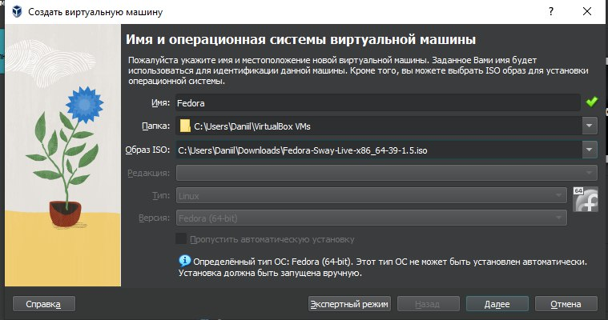{width=30%}

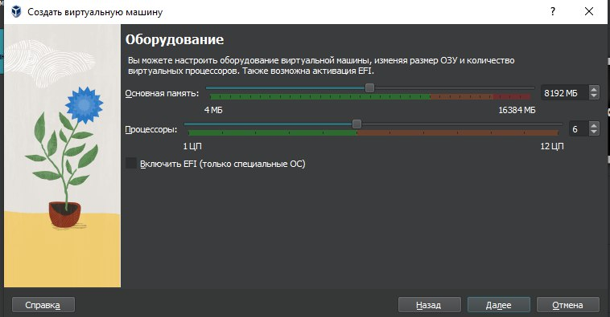{width=30%}

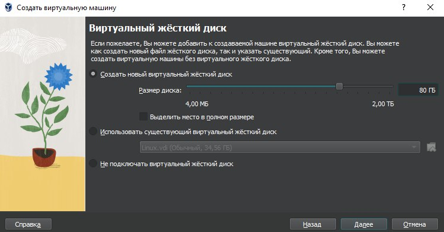{width=30%}

## Установление операционной сисетмы 
- Выбор места установки  
- Создание аккаунта администратора  
- Создание пользователя  

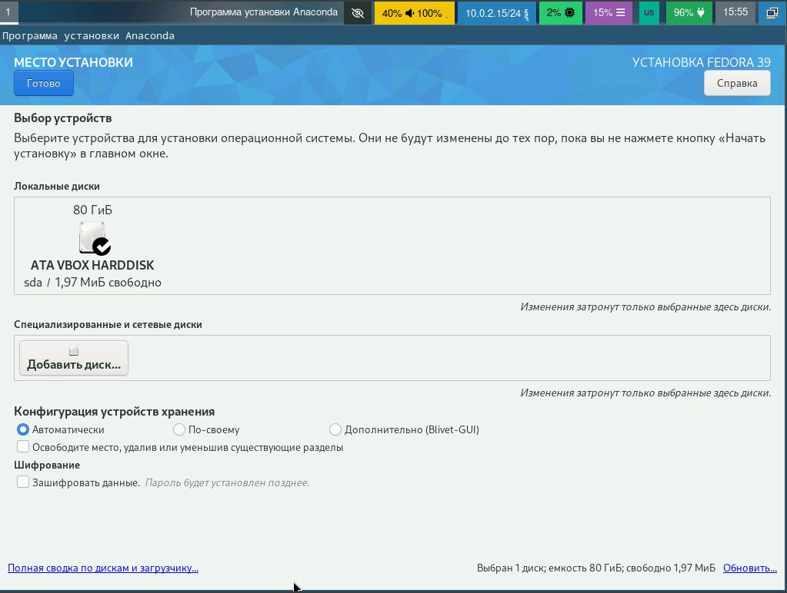{width=30%}

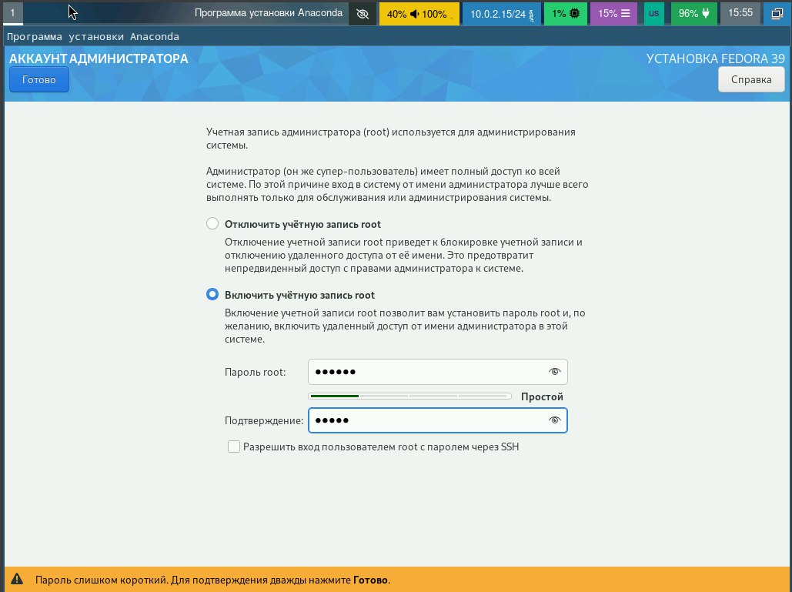{width=30%}

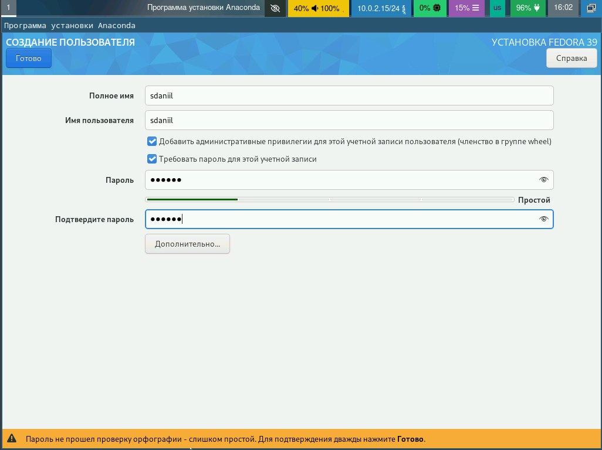{width=30%}

## Обновление пакетов
- Обновление пакетов

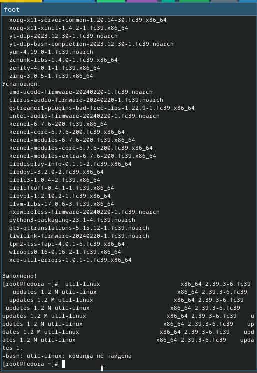{width=60%}

## Установка програмного обеспечения
- Установка ПО

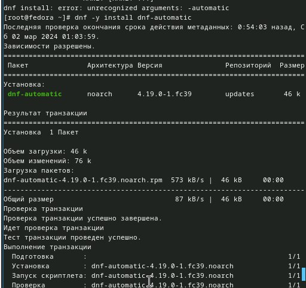{width=60%}

## Установка DKMS
- Установка DKMS

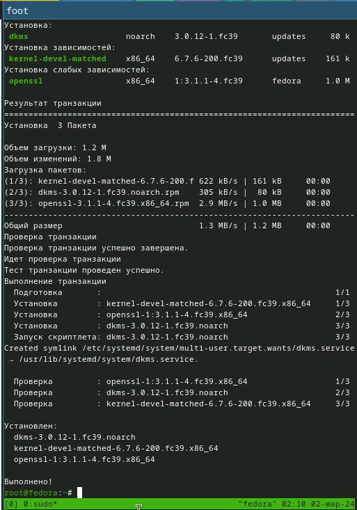{width=60%}

## Средство pandoc для работы с Markdown
- Установка пакетов pandoc

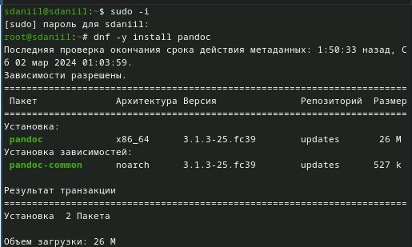{width=60%}

## Дистрибутив TeXLive
- Установка дистрибутива TeXLive

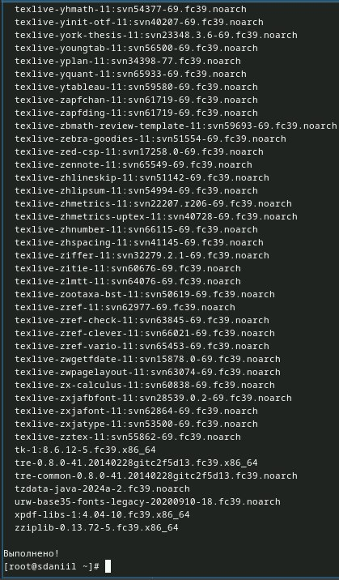{width=60%}

## Получение информации grep
- Версия ядра  
- Модель и частота процессора  
- Объем оперативной памяти  
- Тип файловой системы  

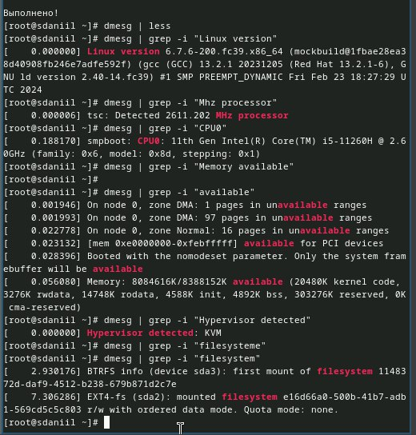{width=60%}

## Вывод
- В итоге выполнения данной лабораторной работы я приобрёл практические навыки установки операционной системы на виртуальную машину, настройки минимально необходимых для дальнейшей работы сервисов.

