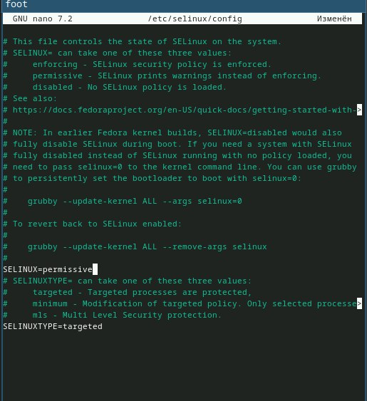
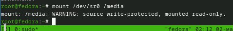

---
## Front matter
title: "Отчёт по лабораторной работе №1"
subtitle: "Установка OC Linux"
author: "Седохин Даниил Алексеевич"

## Generic otions
lang: ru-RU
toc-title: "Содержание"

## Bibliography
bibliography: bib/cite.bib
csl: pandoc/csl/gost-r-7-0-5-2008-numeric.csl

## Pdf output format
toc: true # Table of contents
toc-depth: 2
lof: true # List of figures
lot: false # List of tables
fontsize: 12pt
linestretch: 1.5
papersize: a4
documentclass: scrreprt
## I18n polyglossia
polyglossia-lang:
  name: russian
  options:
	- spelling=modern
	- babelshorthands=true
polyglossia-otherlangs:
  name: english
## I18n babel
babel-lang: russian
babel-otherlangs: english
## Fonts
mainfont: PT Serif
romanfont: PT Serif
sansfont: PT Sans
monofont: PT Mono
mainfontoptions: Ligatures=TeX
romanfontoptions: Ligatures=TeX
sansfontoptions: Ligatures=TeX,Scale=MatchLowercase
monofontoptions: Scale=MatchLowercase,Scale=0.9
## Biblatex
biblatex: true
biblio-style: "gost-numeric"
biblatexoptions:
  - parentracker=true
  - backend=biber
  - hyperref=auto
  - language=auto
  - autolang=other*
  - citestyle=gost-numeric
## Pandoc-crossref LaTeX customization
figureTitle: "Рис."
tableTitle: "Таблица"
listingTitle: "Листинг"
lofTitle: "Список иллюстраций"
lotTitle: "Список таблиц"
lolTitle: "Листинги"
## Misc options
indent: true
header-includes:
  - \usepackage{indentfirst}
  - \usepackage{float} # keep figures where there are in the text
  - \floatplacement{figure}{H} # keep figures where there are in the text
---

# Цель работы

Целью данной работы является приобретение практических навыков установки операционной системы на виртуальную машину, настройки минимально необходимых для дальнейшей работы сервисов.

# Задание

Суть задания заключается в установке OC Linux c дистрибутивом Fedora и настройка OC.

# Теоретическое введение

Выполнение работы возможно как в дисплейном классе факультета физико-математических и естественных наук РУДН, так и дома. Описание выполнения работы приведено для дисплейного класса со следующими характеристиками техники:  

    Intel Core i3-550 3.2 GHz, 4 GB оперативной памяти, 80 GB свободного места на жёстком диске;  
    ОС Linux Gentoo (http://www.gentoo.ru/);  
    VirtualBox версии 7.0 или новее.  

Для установки в виртуальную машину используется дистрибутив Linux Fedora (https://getfedora.org), вариант с менеджером окон sway (https://fedoraproject.org/spins/sway/).  
При выполнении лабораторной работы на своей технике вам необходимо скачать необходимый образ операционной системы (https://fedoraproject.org/spins/sway/download/index.html).  
В дисплейных классах можно воспользоваться образом в каталоге /afs/dk.sci.pfu.edu.ru/common/files/iso.

# Выполнение лабораторной работы

1) Первой задачей будет настройка VirtualBox для дальнейшей установки новой ОС Linux с дистрибутивом Fedora. (рис. [-@fig:001]).

{#fig:001 width=100%}

2) Выделим необходимое количество памяти и процессоров. (рис. [-@fig:002]).

{#fig:002 width=100%}

3) Создадим виртуальный жёсткий диск на 80ГБ. (рис. [-@fig:003]).

{#fig:003 width=100%}

4) Проверим характеристики новой виртуальной машины. (рис. [-@fig:004])

{#fig:004 width=100%}

5) Запустим новую виртуальную машину. (рис. [-@fig:005]).

{#fig:005 width=100%}

6) Нажмем комбинацию Win+Enter для запуска терминала.
В терминале запустим liveinst. (рис. [-@fig:006]).

{#fig:006 width=100%}

7) Выбеберм место установки OC. (рис. [-@fig:007]).

{#fig:007 width=100%}

8) Создадим аккаунт администратора. (рис. [-@fig:008]).

{#fig:008 width=100%}

9) Создадим пользователя. (рис. [-@fig:009]).

{#fig:009 width=100%}

10) После чего начнем установление. (рис. [-@fig:0010]).

{#fig:0010 width=100%}

11) После установки отключим оптический диск и перезапустим виртаульную машину. (рис. [-@fig:0011]).

{#fig:0011 width=100%}

12) Войдем в ОС под заданной при установке учётной записью. (рис. [-@fig:0012]).

{#fig:0012 width=100%}

13) Нажмем комбинацию Win+Enter для запуска терминала.
Переключимся на роль супер-пользователя с помощью команды sudo -i (рис. [-@fig:0013]).

{#fig:0013 width=100%}

14) Обновим все пакеты с помощью команды: dnf -y update (рис. @fig:0014).

{#fig:0014 width=100%}

15) Установим программы для удобства работы в консоли: dnf -y install tmux mc (рис. [-@fig:0015]).

{#fig:0015 width=100%}

16) Установка программного обеспечения: dnf install dnf-automatic (рис. [-@fig:0016]).

{#fig:0016 width=100%}

17) Запустим таймер с помощью: systemctl enable --now dnf-automatic.timer (рис. [-@fig:0017]).

{#fig:0017 width=100%}

18) В данном курсе мы не будем рассматривать работу с системой безопасности SELinux.Поэтому отключим его.
    В файле /etc/selinux/config заменим значение
    SELINUX=enforcing
    на значение
    SELINUX=permissive
    После чего перезагрузим виртуальную машину: reboot (рис. [-@fig:0018]).
    
{#fig:0018 width=100%}

19) Далее нам нужно установить драйвера для VirtualBox.
Войдите в ОС под заданной вами при установке учётной записью.
Нажмем комбинацию Win+Enter для запуска терминала.
Запустим терминальный мультиплексор tmux:
tmux
Переключимся на роль супер-пользователя:
sudo -i (рис. [-@fig:0019]).

{#fig:0019 width=100%}

20) Установим средства разработки:
dnf -y group install "Development Tools" (рис. [-@fig:0020]).

{#fig:0020 width=100%}

21) Установим пакет DKMS:
dnf -y install dkms (рис. [-@fig:0021]).

{#fig:0021 width=100%}

22) В меню виртуальной машины подключим образ диска дополнений гостевой ОС. (рис. [-@fig:0022]).

{#fig:0022 width=100%}

23) Подмонтируйте диск:
mount /dev/sr0 /media (рис. [-@fig:0023]).

{#fig:0023 width=100%}

24) Установим драйвера:
/media/VBoxLinuxAdditions.run
После чего перегрузим виртуальную машину:
reboot (рис. [-@fig:0024]).

{#fig:0024 width=100%}

25) Войдем в ОС под заданной при установке учётной записью.
Нажмем комбинацию Win+Enter для запуска терминала. После чего запустим терминальный мультиплексор tmux:
tmux  
Создадим конфигурационный файл ~/.config/sway/config.d/95-system-keyboard-config.conf: (рис. [-@fig:0025]).

{#fig:0025 width=100%}

26) Отредактируем конфигурационный файл ~/.config/sway/config.d/95-system-keyboard-config.conf: (рис. [-@fig:0026]).

{#fig:0026 width=100%}

27) Переключимся на роль супер-пользователя:
sudo -i (рис. [-@fig:0027]).

{#fig:0027 width=100%}

28) Отредактируем конфигурационный файл /etc/X11/xorg.conf.d/00-keyboard.conf: (рис. [-@fig:0028]).

{#fig:0028 width=100%}

После этого перезагрузим виртуальную машину.

29) Установим имя хоста: 
hostnamectl set-hostname username
Проверим, что имя хоста установлено верно:
hostnamectl (рис. [-@fig:0030]).

{#fig:0030 width=100%}

30) Внутри виртуальной машины добавим своего пользователя в группу vboxsf:
gpasswd -a username vboxsf

31) Создадим папку work в ОС Windows. Запустим командную строку на винд. после чего введем следующую команду, для добавления папки. (рис. [-@fig:0031]).

{#fig:0031 width=100%}

После этих действий перезагружаем виртуальную машину.

32)Нажмем комбинацию Win+Enter для запуска терминала.
    Запустим терминальный мультиплексор tmux:
    tmux  
    Переключимся на роль супер-пользователя:
    sudo -i  
    Средство pandoc для работы с языком разметки Markdown.  
    Установка с помощью менеджера пакетов:
    dnf -y install pandoc (рис. [-@fig:0032]).
    
{#fig:0032 width=100%}

33) Для работы с перекрёстными ссылками мы используем пакет pandoc-crossref. Находим и скачиваем его с репозитория гит по ссылке указанной в лабораторной работе. (рис. [-@fig:0033]).

{#fig:0033 width=100%}

34) После установки переходим в папку с установленным файлом и распаковываем архивы. (рис. [-@fig:0034] [-@fig:0035]).

{#fig:0034 width=100%}

{#fig:0035 width=100%}

35)Установим дистрибутив TeXlive:
    dnf -y install texlive-scheme-full (рис. [-@fig:0036]).
    
{#fig:0036 width=100%}

Домашнее задание

В окне терминала проанализируем последовательность загрузки системы, выполнив команду dmesg. Можно просто просмотреть вывод этой команды: dmesg | less (рис. [-@fig:0037]).

{#fig:0037 width=100%}

С помощью grep:  

dmesg | grep -i "то, что ищем"  

Получим следующую информацию: (рис. [-@fig:0038]).  

    Версия ядра Linux (Linux version).  
    Частота процессора (Detected Mhz processor).  
    Модель процессора (CPU0).  
    Объём доступной оперативной памяти (Memory available).  
    Тип обнаруженного гипервизора (Hypervisor detected).  
    Тип файловой системы корневого раздела.  
    Последовательность монтирования файловых систем.  

{#fig:0038 width=100%}

#Контрольные вопросы

1) Какую информацию содержит учётная запись пользователя?  
   Системное 
имя, идентификатор пользователя, идентификатор группы, полное имя, 
домашний каталог, начальная оболочка.  
2) Укажите команды терминала и приведите примеры:  
для получения справки по команде; man (man ls)  
для перемещения по файловой системе; cd (cd / -перемещение в корневой ка талог)   
для просмотра содержимого каталога; ls (ls / -содержимое корневого каталога)  
для определения объёма каталога; du -s (du -s /etc)  
для создания / удаления каталогов / файлов;; rm  
Пустые каталоги можно удалять командой rmdir (если добавить ключ -s, то 
можно удалять и не только пустые).  
Также любые файлы можно удалять рекур сивно: rm -r 
для задания определённых прав на файл / каталог; chmod (chmod 777 
filename.txt) 
для просмотра истории команд; history  
3) Что такое файловая система? Приведите примеры с краткой характеристи кой.  
 Файловая система - это способ организации и хранения данных на но сителе информации, таком как жесткий диск или флэш-накопитель. Она 
определяет способ, которым файлы и каталоги структурируются, и как к 
ним обращаться.  
Вот несколько примеров файловых систем в Linux:  
ext4 (Fourth Extended Filesystem): Это одна из наиболее распространенных 
файловых систем в Linux. Она обеспечивает хорошую производительность и 
надежность, поддерживает большие размеры файлов и разделов. ext4 является 
стандартной файловой системой для многих дистрибутивов Linux.  
 
Btrfs (B-tree File System): Это современная файловая система, которая поддер живает функции копирования на запись, снимков и сжатия данных. Btrfs предо ставляет возможности по обнаружению и восстановлению поврежденных дан ных, а также управлению множеством дисков.  
XFS (XFS File System): Эта файловая система изначально разработана для 
высокопроизводительных систем. Она обладает хорошей поддержкой больших 
файлов и разделов, а также высокой параллельной производительностью 
ввода-вывода.  
ZFS (Zettabyte File System): Хотя ZFS не является частью ядра Linux из коробки 
из-за проблем лицензирования, он все равно доступен для установки и исполь зования. ZFS предлагает мощные функции, такие как проверка целостности дан ных, снимки, моментальные копии и встроенное RAID.  
F2FS (Flash-Friendly File System): Эта файловая система оптимизирована для 
использования на флэш-накопителях, таких как SSD. F2FS учитывает особенно сти флэш-памяти, такие как износ и способы записи, для повышения произво дительности и срока службы носителя.  
4) Как посмотреть, какие файловые системы подмонтированы в ОС?  
 Коман дой mount 
5) Как удалить зависший процесс? Узнайте идентификатор процесса (PID):  
Вы можете использовать команду ps aux | grep для поиска запущенных про цессов и их PID.  
 Например: ps aux | grep firefox Это покажет список процес сов, связанных с Firefox, и их PID. Используйте команду kill для заверше ния процесса: Как только вы найдете PID зависшего процесса, используй те команду kill с этим PID для завершения процесса. Например kill -9 -9 
это сигнал, который немедленно завершает процесс. Обычно это сработа ет, если процесс завис, и не реагирует на обычные сигналы завершения.

# Выводы

В итоге выполнения данной лабораторной работы я приобрёл практические навыки установки операционной системы на виртуальную машину, настройки минимально необходимых для дальнейшей работы сервисов.

