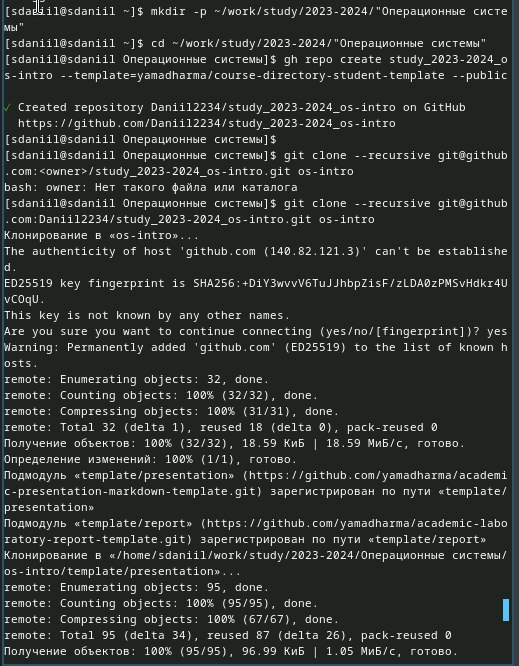

---
## Front matter
lang: ru-RU
title: Лабораторная работа №2
subtitle: Первоначальна настройка git 
author:
  - Седохин Д.А.  
institute:
  - Российский университет дружбы народов, Москва, Россия  
  - 25 февраля 2024
 

## i18n babel
babel-lang: russian
babel-otherlangs: english

## Formatting pdf
toc: false
toc-title: Содержание
slide_level: 2
aspectratio: 169
section-titles: true
theme: metropolis
header-includes:
 - \metroset{progressbar=frametitle,sectionpage=progressbar,numbering=fraction}
 - '\makeatletter'
 - '\beamer@ignorenonframefalse'
 - '\makeatother'
 
##Fonts 
mainfont: PT Serif 
romanfont: PT Serif 
sansfont: PT Sans 
monofont: PT Mono 
mainfontoptions: Ligatures=TeX 
romanfontoptions: Ligatures=TeX 
sansfontoptions: Ligatures=TeX,Scale=MatchLowercase 
monofontoptions: Scale=MatchLowercase,Scale=0.9
---

# Информация

## Докладчик

:::::::::::::: {.columns align=center}
::: {.column width="70%"}

  * Седохин Даниил Алексееивч
  * Группа НПИбд-02-23
  * Российский университет дружбы народов
  * <https://github.com/Daniil2234>

:::
::: {.column width="30%"}

:::
::::::::::::::

# Вводная часть

## Объект и предмет исследования

- Система контроля версий GIT

## Цель работы

- Изучить идеологию и применение средств контроля версий.  
 - Освоить умения по работе с git.

## Установка git 
- Установка git

{width=50%}

## Установка gh
- Установка gh

{width=50%}

## Базовая настройка git
- Задаём имя и email владельца  
- Настройка utf-8

{width=60%}

{width=60%}

## Создание ключей ssh
- Алгоритм rsa 

{width=60%}

## Создание ключей ssh
- Алгоритм ed25519

{width=60%}

## Создание ключей pgp
- Генерация ключа  
- Указываем тип, размер, срок действия, имя, адрес..

{width=60%}

## Добавление PGP ключа в GitHub
- Копируем отпечаток приватного ключа  
- Копируем свой ключ PGP 

{width=60%}

## New GPG key
- В GitHub вставляем полученный ключ

{width=60%}

## Настройка автоматических подписей коммитов git
- Настройка подписей коммитов  

{width=60%}

## Настройка gh
- Авторизация через браузер

{width=60%}

## Создание репозитория курса на основе шаблона
- Создаём репозиторий курса

{width=60%}

##  Настройка каталога курса
- Удаляем лишние файлы  
- Создаём необходимые каталоги

{width=60%}

##  Отправка файлов на сервер

{width=60%}

## Вывод
- Я Изучил идеологию и применение средств контроля версий.  
    Освоил умения по работе с git.
