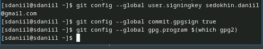

---
## Front matter
title: "Отчёт по лабораторной работе №2"
subtitle: "Первоначальна настройка git"
author: "Седохин Даниил Алексеевич"

## Generic otions
lang: ru-RU
toc-title: "Содержание"

## Bibliography
bibliography: bib/cite.bib
csl: pandoc/csl/gost-r-7-0-5-2008-numeric.csl

## Pdf output format
toc: true # Table of contents
toc-depth: 2
lof: true # List of figures
lot: false # List of tables
fontsize: 12pt
linestretch: 1.5
papersize: a4
documentclass: scrreprt
## I18n polyglossia
polyglossia-lang:
  name: russian
  options:
	- spelling=modern
	- babelshorthands=true
polyglossia-otherlangs:
  name: english
## I18n babel
babel-lang: russian
babel-otherlangs: english
## Fonts
mainfont: PT Serif
romanfont: PT Serif
sansfont: PT Sans
monofont: PT Mono
mainfontoptions: Ligatures=TeX
romanfontoptions: Ligatures=TeX
sansfontoptions: Ligatures=TeX,Scale=MatchLowercase
monofontoptions: Scale=MatchLowercase,Scale=0.9
## Biblatex
biblatex: true
biblio-style: "gost-numeric"
biblatexoptions:
  - parentracker=true
  - backend=biber
  - hyperref=auto
  - language=auto
  - autolang=other*
  - citestyle=gost-numeric
## Pandoc-crossref LaTeX customization
figureTitle: "Рис."
tableTitle: "Таблица"
listingTitle: "Листинг"
lofTitle: "Список иллюстраций"
lotTitle: "Список таблиц"
lolTitle: "Листинги"
## Misc options
indent: true
header-includes:
  - \usepackage{indentfirst}
  - \usepackage{float} # keep figures where there are in the text
  - \floatplacement{figure}{H} # keep figures where there are in the text
  
---

# Цель работы

    Изучить идеологию и применение средств контроля версий.  
    Освоить умения по работе с git.

# Задание

    Создать базовую конфигурацию для работы с git.  
    Создать ключ SSH.  
    Создать ключ PGP.  
    Настроить подписи git.  
    Зарегистрироваться на Github.  
    Создать локальный каталог для выполнения заданий по предмету.

# Теоретическое введение
Системы контроля версий. Общие понятия:  

Системы контроля версий (Version Control System, VCS) применяются при работе нескольких человек над одним проектом. Обычно основное дерево проекта хранится в локальном или удалённом репозитории, к которому настроен доступ для участников проекта. При внесении изменений в содержание проекта система контроля версий позволяет их фиксировать, совмещать изменения, произведённые разными участниками проекта, производить откат к любой более ранней версии проекта, если это требуется.  

В классических системах контроля версий используется централизованная модель, предполагающая наличие единого репозитория для хранения файлов. Выполнение большинства функций по управлению версиями осуществляется специальным сервером. Участник проекта (пользователь) перед началом работы посредством определённых команд получает нужную ему версию файлов. После внесения изменений, пользователь размещает новую версию в хранилище. При этом предыдущие версии не удаляются из центрального хранилища и к ним можно вернуться в любой момент. Сервер может сохранять не полную версию изменённых файлов, а производить так называемую дельта-компрессию — сохранять только изменения между последовательными версиями, что позволяет уменьшить объём хранимых данных.  

Системы контроля версий поддерживают возможность отслеживания и разрешения конфликтов, которые могут возникнуть при работе нескольких человек над одним файлом. Можно объединить (слить) изменения, сделанные разными участниками (автоматически или вручную), вручную выбрать нужную версию, отменить изменения вовсе или заблокировать файлы для изменения. В зависимости от настроек блокировка не позволяет другим пользователям получить рабочую копию или препятствует изменению рабочей копии файла средствами файловой системы ОС, обеспечивая таким образом, привилегированный доступ только одному пользователю, работающему с файлом.  

Системы контроля версий также могут обеспечивать дополнительные, более гибкие функциональные возможности. Например, они могут поддерживать работу с несколькими версиями одного файла, сохраняя общую историю изменений до точки ветвления версий и собственные истории изменений каждой ветви. Кроме того, обычно доступна информация о том, кто из участников, когда и какие изменения вносил. Обычно такого рода информация хранится в журнале изменений, доступ к которому можно ограничить.  

В отличие от классических, в распределённых системах контроля версий центральный репозиторий не является обязательным.  

Среди классических VCS наиболее известны CVS, Subversion, а среди распределённых — Git, Bazaar, Mercurial. Принципы их работы схожи, отличаются они в основном синтаксисом используемых в работе команд.  

Примеры использования git  

    Система контроля версий Git представляет собой набор программ командной строки. Доступ к ним можно получить из терминала посредством ввода команды git с различными опциями.  
    Благодаря тому, что Git является распределённой системой контроля версий, резервную копию локального хранилища можно сделать простым копированием или архивацией.  

Основные команды git  

    Перечислим наиболее часто используемые команды git.  

    Создание основного дерева репозитория:

    git init  

    Получение обновлений (изменений) текущего дерева из центрального репозитория:

    git pull  

    Отправка всех произведённых изменений локального дерева в центральный репозиторий:

    git push  

    Просмотр списка изменённых файлов в текущей директории:

    git status  

    Просмотр текущих изменений:

    git diff  

Стандартные процедуры работы при наличии центрального репозитория  

    Работа пользователя со своей веткой начинается с проверки и получения изменений из центрального репозитория (при этом в локальное дерево до начала этой процедуры не должно было вноситься изменений):  

    git checkout master  
    git pull  
    git checkout -b имя_ветки  

    Затем можно вносить изменения в локальном дереве и/или ветке.  

    После завершения внесения какого-то изменения в файлы и/или каталоги проекта необходимо разместить их в центральном репозитории. Для этого необходимо проверить, какие файлы изменились к текущему моменту:  

    git status  

    При необходимости удаляем лишние файлы, которые не хотим отправлять в центральный репозиторий.  

    Затем полезно просмотреть текст изменений на предмет соответствия правилам ведения чистых коммитов:  

    git diff  

    Если какие-либо файлы не должны попасть в коммит, то помечаем только те файлы, изменения которых нужно сохранить. Для этого используем команды добавления и/или удаления с нужными опциями:  

    git add …  
    git rm …  

    Если нужно сохранить все изменения в текущем каталоге, то используем:  

    git add .  

    Затем сохраняем изменения, поясняя, что было сделано:  

    git commit -am "Some commit message"  

    Отправляем изменения в центральный репозиторий:  

    git push origin имя_ветки 
    или

    git push  
    
Работа с локальным репозиторием  

    Создадим локальный репозиторий.  

    Сначала сделаем предварительную конфигурацию, указав имя и email владельца репозитория:  

    git config --global user.name "Имя Фамилия"  
    git config --global  user.email "work@mail"  

    Настроим utf-8 в выводе сообщений git:  

    git config --global quotepath false  

    Для инициализации локального репозитория,   расположенного, например, в каталоге ~/tutorial,   необходимо ввести в командной строке:  

    cd   
    mkdir tutorial  
    cd tutorial  
    git init  

    После это в каталоге tutorial появится каталог .git, в котором будет храниться история изменений.  

    Создадим тестовый текстовый файл hello.txt и добавим его в локальный репозиторий:  

    echo 'hello world' > hello.txt  
    git add hello.txt  
    git commit -am 'Новый файл'  

    Воспользуемся командой status для просмотра изменений в рабочем каталоге, сделанных с момента последней ревизии:  

    git status  

    Во время работы над проектом так или иначе могут создаваться файлы, которые не требуется добавлять в последствии в репозиторий. Например, временные файлы, создаваемые редакторами, или объектные файлы, создаваемые компиляторами. Можно прописать шаблоны игнорируемых при добавлении в репозиторий типов файлов в файл .gitignore с помощью сервисов. Для этого сначала нужно получить список имеющихся шаблонов:  
  
    curl -L -s https://www.gitignore.io/api/list  

    Затем скачать шаблон, например, для C и C++  

    curl -L -s https://www.gitignore.io/api/c >> .gitignore  
    curl -L -s https://www.gitignore.io/api/c++ >> .gitignore  

# Выполнение лабораторной работы

1)  Установим git:  

    dnf install git (рис. [-@fig:001]).

{#fig:001 width=100%}

2) Установка gh  
    Fedora:  

    dnf install gh (рис. [-@fig:002]).

{#fig:002 width=100%}

3) Зададим имя и email владельца репозитория:  
git config --global user.name "Name Surname"  
git config --global user.email "work@mail". (рис. [-@fig:003] [-@fig:0030]).

{#fig:003 width=100%}

{#fig:0030 width=100%}

4) Настроим utf-8 в выводе сообщений git:  
git config --global core.quotepath false (рис. [-@fig:004])

{#fig:004 width=100%}

5) Зададим имя начальной ветки (будем называть её master):  

git config --global init.defaultBranch master  
Также зададим следующие параметры: (рис. [-@fig:005]).
Параметр autocrlf:  

git config --global core.autocrlf input  

Параметр safecrlf:  

git config --global core.safecrlf warn  

{#fig:005 width=100%}

6) Создадим ключи ssh  
По алгоритму rsa с ключём размером 4096 бит:  

ssh-keygen -t rsa -b 4096 (рис. [-@fig:006]).

{#fig:006 width=100%}

7) Выполним те же действия по алгоритму ed25519:  
ssh-keygen -t ed25519 (рис. [-@fig:007]).

{#fig:007 width=100%}

8) Создадим ключи pgp.  
    Генерируем ключ  
    gpg --full-generate-key  

    Из предложенных опций выбираем:  
       тип RSA and RSA;  
       размер 4096;  
       выберем срок действия;  
       значение по умолчанию — 0 (срок действия не истекает никогда).  
    GPG запросит личную информацию, которая сохранится в ключе:  
       Имя (не менее 5 символов).  
       Адрес электронной почты.  
       При вводе email убедимся, что он соответствует адресу, используемому на GitHub.  
       Комментарий. Можно ввести что угодно или нажать клавишу ввода, чтобы оставить это поле пустым. (рис. [-@fig:008]).

{#fig:008 width=100%}

9) Выводим список ключей и копируем отпечаток приватного ключа:  
gpg --list-secret-keys --keyid-format LONG (рис. [-@fig:009]).

{#fig:009 width=100%}

10) Cкопируем сгенерированный PGP ключ в буфер обмена:  
gpg --armor --export <PGP Fingerprint> | xclip -sel clip (рис. [-@fig:0010]).

{#fig:0010 width=100%}

11) Перейдем в настройки GitHub (https://github.com/settings/keys), нажмем на кнопку New GPG key и вставим полученный ключ в поле ввода. (рис. [-@fig:0011]).

{#fig:0011 width=100%}

12) Настроим автоматические подписи коммитов git  

    Используя введёный email, укажем Git применять его при подписи коммитов:  

    git config --global user.signingkey <PGP Fingerprint>  
    git config --global commit.gpgsign true  
    git config --global gpg.program $(which gpg2) (рис. [-@fig:0012]).

{#fig:0012 width=100%}

13) Настройка gh  
    Для начала необходимо авторизоваться  

    gh auth login  

    Утилита задаст несколько наводящих вопросов, ответив на которые мы успешно авторизируемся (рис. [-@fig:0013]).

{#fig:0013 width=100%}

14) Создание репозитория курса на основе шаблона  
    Необходимо создать шаблон рабочего пространства  

    Например, для 2023–2024 учебного года и предмета «Операционные системы» (код предмета os-intro) создание репозитория примет следующий вид (рис. [-@fig:0014]) (рис. [-@fig:0015]).

{#fig:0014 width=100%}

{#fig:0015 width=100%}

15) Настройка каталога курса (рис. [-@fig:0016]).  
    Перейдем в каталог курса:  

    cd ~/work/study/2022-2023/"Операционные системы"/os-intro  

    Удалим лишние файлы:  

    rm package.json  

    Создадим необходимые каталоги:  

    echo os-intro > COURSE  
    make

{#fig:0016 width=100%}

16) Отправим файлы на сервер: (рис. [-@fig:0017]).  

git add .  
git commit -am 'feat(main): make course structure'  
git push

{#fig:0017 width=100%}

# Контрольные вопросы

1) Что такое системы контроля версий (VCS) и для решения каких задач они 
предназначаются?  
Системы контроля версий (VCS) - это инструменты, которые отслеживают 
изменения в файловой системе с течением времени. Они предназначены 
для управления изменениями в коде и других файлах проекта, позволяя 
разработчикам работать над проектом одновременно, откатывать измене ния, если что-то идет не так, и отслеживать историю изменений.  
2) Объясните следующие понятия VCS и их отношения: хранилище, commit, 
история, рабочая копия.  
Хранилище (repository): Это место, где хранятся все файлы и история из менений проекта.  
Commit: Это операция сохранения изменений в репо зитории. При коммите фиксируются все изменения, сделанные с момента 
предыдущего коммита.  
 История (history): Это записи о всех коммитах, сде ланных в репозитории.  
  Рабочая копия (working copy): Это копия файлов из 
репозитория, с которой вы работаете на вашем компьютере.  
3) Что представляют собой и чем отличаются централизованные и децентра лизованные VCS? Приведите примеры VCS каждого вида.  
Централизованные VCS имеют одно основное хранилище, к которому 
подключаются все клиенты.  
 Децентрализованные VCS позволяют каж дому клиенту иметь собственное полноценное хранилище.  
 Примеры
централизованных VCS: Subversion (SVN).  
Примеры децентрализованных 
VCS: Git, Mercurial.  
4) Опишите действия с VCS при единоличной работе с хранилищем.  
При единоличной работе с хранилищем в VCS вы создаете, изменяете и фик сируете изменения в рабочей копии и затем коммитите их в репозиторий.  
5) Опишите порядок работы с общим хранилищем VCS.  
Порядок работы с общим хранилищем VCS включает получение последних 
изменений из репозитория (pull), внесение своих изменений, фиксацию изме нений (commit) и отправку их в репозиторий (push).  
6) Каковы основные задачи, решаемые инструментальным средством git?  
Основные задачи инструмента git:  
Отслеживание изменений в файлах.  
Управление версиями проекта.  
Работа с удаленными репозиториями.  
Ветвление и слияние изменений.  
Работа с ветками.  
7) Назовите и дайте краткую характеристику командам git.  
Некоторые команды git:  
git init: Создает новый репозиторий.  
git add: Добавляет файлы в индекс для последующего коммита.  
git commit: Фиксирует изменения в репозитории.  
git push: Отправляет изменения в удаленный репозиторий.  
git pull: Получает изменения из удаленного репозитория и объединяет их с текущей веткой.  
8) Приведите примеры использования при работе с локальным и удалённым 
репозиториями.  
Примеры использования при работе с локальным и удаленным репозиториями:  
Локальный: Создание нового репозитория с помощью git init.  
Удаленный: Клонирование существующего удаленного репозитория с помощью git clone.  
9) Что такое и зачем могут быть нужны ветви (branches)?  
Ветви (branches) - это параллельные линии разработки в репозитории, кото рые позволяют работать над разными фичами или исправлениями, не затраги вая основную ветку. Они могут быть нужны, чтобы изолировать разные функ циональные изменения или исправления ошибок.  
10) Как и зачем можно игнорировать некоторые файлы при commit?  
Файлы могут быть проигнорированы при коммите с помощью файла 
.gitignore. В этом файле перечисляются шаблоны файлов или папок, которые 
не должны быть добавлены в репозиторий.

# Выводы

Я Изучил идеологию и применение средств контроля версий.  
    Освоил умения по работе с git.
    
    
    
    
