---
## Front matter
lang: ru-RU
title: Лабораторная работа №4
subtitle: Продвинутое использование git
author:
  - Седохин Д.А.  
institute:
  - Российский университет дружбы народов, Москва, Россия  
  - 7 марта 2024
 

## i18n babel
babel-lang: russian
babel-otherlangs: english

## Formatting pdf
toc: false
toc-title: Содержание
slide_level: 2
aspectratio: 169
section-titles: true
theme: metropolis
header-includes:
 - \metroset{progressbar=frametitle,sectionpage=progressbar,numbering=fraction}
 - '\makeatletter'
 - '\beamer@ignorenonframefalse'
 - '\makeatother'
 
##Fonts 
mainfont: PT Serif 
romanfont: PT Serif 
sansfont: PT Sans 
monofont: PT Mono 
mainfontoptions: Ligatures=TeX 
romanfontoptions: Ligatures=TeX 
sansfontoptions: Ligatures=TeX,Scale=MatchLowercase 
monofontoptions: Scale=MatchLowercase,Scale=0.9
---

# Информация

## Докладчик

:::::::::::::: {.columns align=center}
::: {.column width="70%"}

  * Седохин Даниил Алексееивч
  * Группа НПИбд-02-23
  * Российский университет дружбы народов
  * <https://github.com/Daniil2234>

:::
::: {.column width="30%"}

:::
::::::::::::::

# Вводная часть

## Цель работы

Получение навыков правильной работы с репозиториями git.

## Установка git-flow
- Установка git-flow

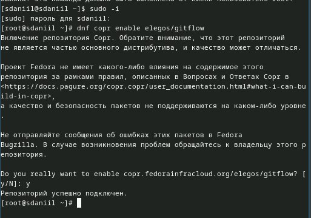{width=50%}

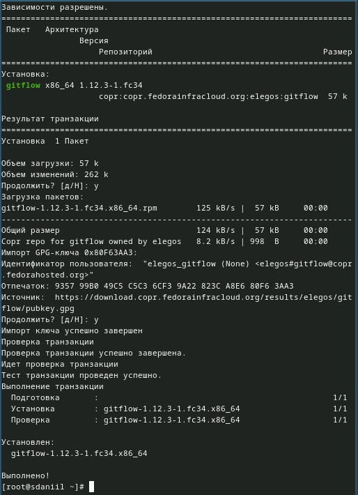{width=50%}

## Установка Node.js
- Установка Node.js

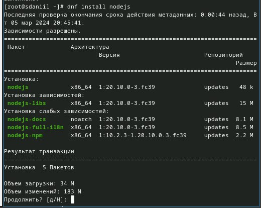{width=50%}

## Настройка Node.js
- Для работы с Node.js добавим каталог с исполняемыми файлами и установим yarn

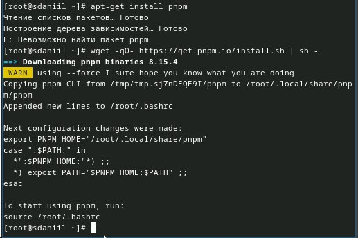{width=60%}

## Commitizen
- Программа используется для помощи в форматировании коммитов.  
- устанавливается скрипт git-cz.

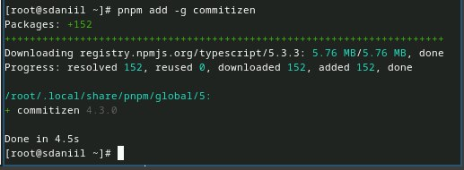{width=60%}

## Создание репозитория git
- Создание репозитория на GitHub  
- Делаем первый коммит и выкладываем на github  

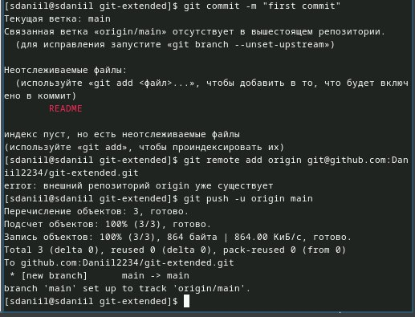{width=60%}

## Конфигурация для пакетов Node.js
- Заполняем несколько параметров пакета

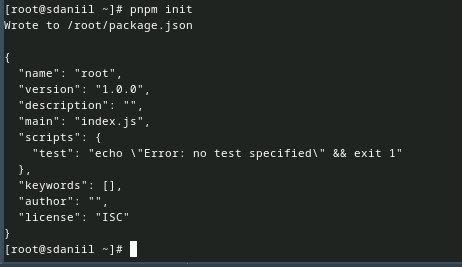{width=60%}

##  Изменение package.json
- Добавление в файл package.json команды для формирования коммитов

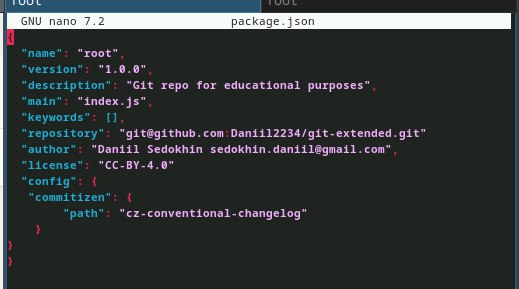{width=60%}

## Отправка файлов на github
- Добавим файлы  
- Выполним коммит  
- Отправим на github

{width=60%}

## Установление внешней ветки как вышестоящей
- Установление внешней ветки как вышестоящей

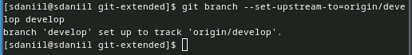{width=60%}

## Создание релиза с версией 1.0.0
- Создание релиза с версией 1.0.0

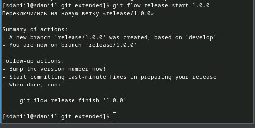{width=60%}

## Создание журнала изменений
- Добавление журнала изменений в индекс

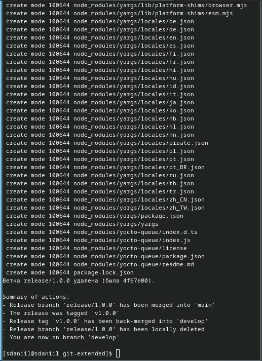{width=60%}

##  Отправка данных
- Отправим данные на github  
- Создание релиза на github

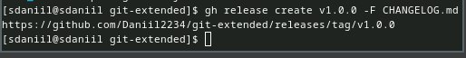{width=60%}

## Создание релиза git-flow
- Создание релиза с версией 1.2.3  
- Создадание журнала изменений  
- Добавление журнала изменений в индекс

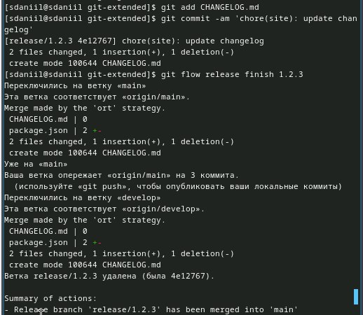{width=60%}

## Отправка данных на github
- Cоздание релиза на github

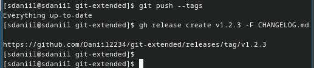{width=60%}

## Вывод
- Я получил навыки правильной работы с репозиториями git.
