---
## Front matter
title: "Отчёт по лабораторной работе №4"
subtitle: "Продвинутое использование git."
author: "Седохин Даниил Алексеевич"

## Generic otions
lang: ru-RU
toc-title: "Содержание"

## Bibliography
bibliography: bib/cite.bib
csl: pandoc/csl/gost-r-7-0-5-2008-numeric.csl

## Pdf output format
toc: true # Table of contents
toc-depth: 2
lof: true # List of figures
lot: false # List of tables
fontsize: 12pt
linestretch: 1.5
papersize: a4
documentclass: scrreprt
## I18n polyglossia
polyglossia-lang:
  name: russian
  options:
	- spelling=modern
	- babelshorthands=true
polyglossia-otherlangs:
  name: english
## I18n babel
babel-lang: russian
babel-otherlangs: english
## Fonts
mainfont: PT Serif
romanfont: PT Serif
sansfont: PT Sans
monofont: PT Mono
mainfontoptions: Ligatures=TeX
romanfontoptions: Ligatures=TeX
sansfontoptions: Ligatures=TeX,Scale=MatchLowercase
monofontoptions: Scale=MatchLowercase,Scale=0.9
## Biblatex
biblatex: true
biblio-style: "gost-numeric"
biblatexoptions:
  - parentracker=true
  - backend=biber
  - hyperref=auto
  - language=auto
  - autolang=other*
  - citestyle=gost-numeric
## Pandoc-crossref LaTeX customization
figureTitle: "Рис."
tableTitle: "Таблица"
listingTitle: "Листинг"
lofTitle: "Список иллюстраций"
lotTitle: "Список таблиц"
lolTitle: "Листинги"
## Misc options
indent: true
header-includes:
  - \usepackage{indentfirst}
  - \usepackage{float} # keep figures where there are in the text
  - \floatplacement{figure}{H} # keep figures where there are in the text
  
---

# Цель работы

Получение навыков правильной работы с репозиториями git.

# Задание

    Выполнить работу для тестового репозитория.  
    Преобразовать рабочий репозиторий в репозиторий с git-flow и conventional commits.
    
# Теоретическое введение

Рабочий процесс Gitflow  

    Рабочий процесс Gitflow Workflow. Будем описывать его с использованием пакета git-flow.  

Общая информация  

    Gitflow Workflow опубликована и популяризована Винсентом Дриссеном.  
    Gitflow Workflow предполагает выстраивание строгой модели ветвления с учётом выпуска проекта.  
    Данная модель отлично подходит для организации рабочего процесса на основе релизов.  
    Работа по модели Gitflow включает создание отдельной ветки для исправлений ошибок в рабочей среде.  
    Последовательность действий при работе по модели Gitflow:  
        Из ветки master создаётся ветка develop.  
        Из ветки develop создаётся ветка release.  
        Из ветки develop создаются ветки feature.  
        Когда работа над веткой feature завершена, она сливается с веткой develop.  
        Когда работа над веткой релиза release завершена, она сливается в ветки develop и master.  
        Если в master обнаружена проблема, из master создаётся ветка hotfix.  
        Когда работа над веткой исправления hotfix завершена, она сливается в ветки develop и master.  

Процесс работы с Gitflow  

    Основные ветки (master) и ветки разработки (develop)  
        Для фиксации истории проекта в рамках этого процесса вместо одной ветки master используются две ветки. В ветке master хранится официальная история релиза, а ветка develop предназначена для объединения всех функций. Кроме того, для удобства рекомендуется присваивать всем коммитам в ветке master номер версии.

        При использовании библиотеки расширений git-flow нужно инициализировать структуру в существующем репозитории:  

        git flow init  

        Для github параметр Version tag prefix следует установить в v.  

        После этого проверьте, на какой ветке Вы находитесь:  

        git branch  

    Функциональные ветки (feature)  
        Под каждую новую функцию должна быть отведена собственная ветка, которую можно отправлять в центральный репозиторий для создания резервной копии или совместной работы команды. Ветки feature создаются не на основе master, а на основе develop. Когда работа над функцией завершается, соответствующая ветка сливается обратно с веткой develop. Функции не следует отправлять напрямую в ветку master.
        Как правило, ветки feature создаются на основе последней ветки develop.

        Создание функциональной ветки

            Создадим новую функциональную ветку:

            git flow feature start feature_branch

            Далее работаем как обычно.

        Окончание работы с функциональной веткой

            По завершении работы над функцией следует объединить ветку feature_branch с develop:

            git flow feature finish feature_branch

    Ветки выпуска (release)
        Когда в ветке develop оказывается достаточно функций для выпуска, из ветки develop создаётся ветка release. Создание этой ветки запускает следующий цикл выпуска, и с этого момента новые функции добавить больше нельзя — допускается лишь отладка, создание документации и решение других задач. Когда подготовка релиза завершается, ветка release сливается с master и ей присваивается номер версии. После нужно выполнить слияние с веткой develop, в которой с момента создания ветки релиза могли возникнуть изменения.
        Благодаря тому, что для подготовки выпусков используется специальная ветка, одна команда может дорабатывать текущий выпуск, в то время как другая команда продолжает работу над функциями для следующего.

        Создать новую ветку release можно с помощью следующей команды:

        git flow release start 1.0.0

        Для завершения работы на ветке release используются следующие команды:

        git flow release finish 1.0.0

    Ветки исправления (hotfix)
        Ветки поддержки или ветки hotfix используются для быстрого внесения исправлений в рабочие релизы. Они создаются от ветки master. Это единственная ветка, которая должна быть создана непосредственно от master. Как только исправление завершено, ветку следует объединить с master и develop. Ветка master должна быть помечена обновлённым номером версии.
        Наличие специальной ветки для исправления ошибок позволяет команде решать проблемы, не прерывая остальную часть рабочего процесса и не ожидая следующего цикла релиза.

        Ветку hotfix можно создать с помощью следующих команд:

        git flow hotfix start hotfix_branch

        По завершении работы ветка hotfix объединяется с master и develop:

        git flow hotfix finish hotfix_branch

Семантическое версионирование

Семантический подход в версионированию программного обеспечения.

Краткое описание семантического версионирования

    Семантическое версионирование описывается в манифесте семантического версионирования.

    Кратко его можно описать следующим образом:
        Версия задаётся в виде кортежа МАЖОРНАЯ_ВЕРСИЯ.МИНОРНАЯ_ВЕРСИЯ.ПАТЧ.
        Номер версии следует увеличивать:
            МАЖОРНУЮ версию, когда сделаны обратно несовместимые изменения API.
            МИНОРНУЮ версию, когда вы добавляете новую функциональность, не нарушая обратной совместимости.
            ПАТЧ-версию, когда вы делаете обратно совместимые исправления.
        Дополнительные обозначения для предрелизных и билд-метаданных возможны как дополнения к МАЖОРНАЯ.МИНОРНАЯ.ПАТЧ формату.

Программное обеспечение

    Для реализации семантического версионирования создано несколько программных продуктов.
    При этом лучше всего использовать комплексные продукты, которые используют информацию из коммитов системы версионирования.
    Коммиты должны иметь стандартизованный вид.
    В семантическое версионирование применяется вместе с общепринятыми коммитами.

    Пакет Conventional Changelog
        Пакет Conventional Changelog является комплексным решением по управлению коммитами и генерации журнала изменений.
        Содержит набор утилит, которые можно использовать по-отдельности.

Общепринятые коммиты

Использование спецификации Conventional Commits.

Описание

Спецификация Conventional Commits:

    Соглашение о том, как нужно писать сообщения commit'ов.
    Совместимо с SemVer. Даже вернее сказать, сильно связано с семантическим версионированием.
    Регламентирует структуру и основные типы коммитов.

    Структура коммита

    <type>(<scope>): <subject>  
    <BLANK LINE>  
    <body>  
    <BLANK LINE>  
    <footer>  

    Или, по-русски:  

    <тип>(<область>): <описание изменения>  
    <пустая линия>  
    [необязательное тело]  
    <пустая линия>  
    [необязательный нижний колонтитул]  

        Заголовок является обязательным.
        Любая строка сообщения о фиксации не может быть длиннее 100 символов.
        Тема (subject) содержит краткое описание изменения.
            Используйте повелительное наклонение в настоящем времени: «изменить» ("change" not "changed" nor "changes").
            Не используйте заглавную первую букву.
            Не ставьте точку в конце.
        Тело (body) должно включать мотивацию к изменению и противопоставлять это предыдущему поведению.
            Как и в теме, используйте повелительное наклонение в настоящем времени.
        Нижний колонтитул (footer) должен содержать любую информацию о критических изменениях.
            Следует использовать для указания внешних ссылок, контекста коммита или другой мета информации.
            Также содержит ссылку на issue (например, на github), который закрывает эта фиксация.
            Критические изменения должны начинаться со слова BREAKING CHANGE: с пробела или двух символов новой строки. Затем для этого используется остальная часть сообщения фиксации.

    Типы коммитов

        Базовые типы коммитов
            fix: — коммит типа fix исправляет ошибку (bug) в вашем коде (он соответствует PATCH в SemVer).
            feat: — коммит типа feat добавляет новую функцию (feature) в ваш код (он соответствует MINOR в SemVer).
            BREAKING CHANGE: — коммит, который содержит текст BREAKING CHANGE: в начале своего не обязательного тела сообщения (body) или в подвале (footer), добавляет изменения, нарушающие обратную совместимость вашего API (он соответствует MAJOR в SemVer). BREAKING CHANGE может быть частью коммита любого типа.
            revert: — если фиксация отменяет предыдущую фиксацию. Начинается с revert:, за которым следует заголовок отменённой фиксации. В теле должно быть написано: Это отменяет фиксацию <hash> (это SHA-хэш отменяемой фиксации).
            Другое: коммиты с типами, которые отличаются от fix: и feat:, также разрешены. Например, @commitlint/config-conventional (основанный на The Angular convention) рекомендует: chore:, docs:, style:, refactor:, perf:, test:, и другие.

        Соглашения The Angular convention
            Одно из популярных соглашений о поддержке исходных кодов — конвенция Angular (The Angular convention).

            Типы коммитов The Angular convention

            Конвенция Angular (The Angular convention) требует следующие типы коммитов:
                build: — изменения, влияющие на систему сборки или внешние зависимости (примеры областей (scope): gulp, broccoli, npm).
                ci: — изменения в файлах конфигурации и скриптах CI (примеры областей: Travis, Circle, BrowserStack, SauceLabs).
                docs: — изменения только в документации.
                feat: — новая функция.
                fix: — исправление ошибок.
                perf: — изменение кода, улучшающее производительность.
                refactor: — Изменение кода, которое не исправляет ошибку и не добавляет функции (рефакторинг кода).
                style: — изменения, не влияющие на смысл кода (пробелы, форматирование, отсутствие точек с запятой и т. д.).
                test: — добавление недостающих тестов или исправление существующих тестов.

            Области действия (scope)

            Областью действия должно быть имя затронутого пакета npm (как его воспринимает человек, читающий журнал изменений, созданный из сообщений фиксации).

            Есть несколько исключений из правила «использовать имя пакета»:
                packaging — используется для изменений, которые изменяют структуру пакета, например, изменения общедоступного пути.
                changelog — используется для обновления примечаний к выпуску в CHANGELOG.md.
                отсутствует область действия — полезно для изменений стиля, тестирования и рефакторинга, которые выполняются во всех пакетах (например, style: добавить отсутствующие точки с запятой).

        Соглашения @commitlint/config-conventional

        Соглашение @commitlint/config-conventional входит в пакет Conventional Changelog. В целом в этом соглашении придерживаются соглашения Angular.

# Выполнение лабораторной работы

1)  Установим git-flow:  

    dnf copr enable elegos/gitflow  
    dnf install gitflow (рис. [-@fig:001] [-@fig:002]).

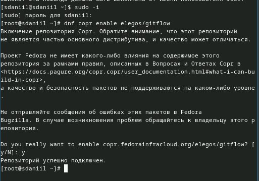{#fig:001 width=100%}

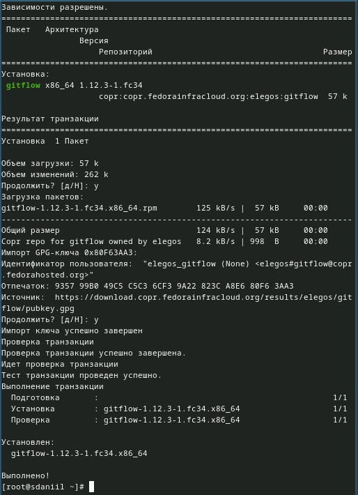{#fig:002 width=100%}

2) Установка Node.js  

На Node.js базируется программное обеспечение для семантического версионирования и общепринятых коммитов.  

    dnf install nodejs  
    apt-get install pnpm. (рис. [-@fig:003]).

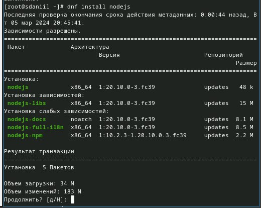{#fig:003 width=100%}

3) Настройка Node.js  

Для работы с Node.js добавим каталог с исполняемыми файлами, устанавливаемыми yarn, в переменную PATH.  

    Запустим:  

    pnpm setup  

    Перелогинимся, или выполним:  

    source ~/.bashrc. (рис. [-@fig:004]).

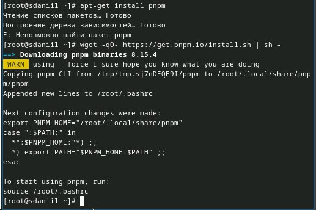{#fig:004 width=100%}

4) commitizen  

    Данная программа используется для помощи в форматировании коммитов.  

    pnpm add -g commitizen  

    При этом устанавливается скрипт git-cz, который мы и будем использовать для коммитов. (рис. [-@fig:006])

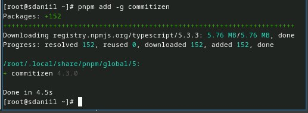{#fig:006 width=100%}

5) standard-changelog  

    Данная программа используется для помощи в создании логов.  

    pnpm add -g standard-changelog (рис. [-@fig:007]).

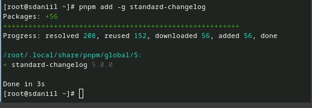{#fig:007 width=100%}

6) Практический сценарий использования git  

    Создание репозитория git  
     Создадим репозиторий на GitHub. Для примера назовём его git-extended. (рис. [-@fig:008]).

           
{#fig:008 width=100%}

7) Делаем первый коммит и выкладываем на github:  

git commit -m "first commit"  
git remote add origin git@github.com:<username>/git-extended.git  
git push -u origin master (рис. [-@fig:009]).

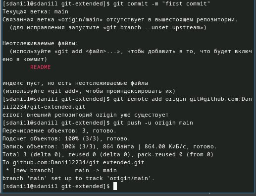{#fig:009 width=100%}

8) Конфигурация для пакетов Node.js  

pnpm init  

Необходимо заполнить несколько параметров пакета.  

    Название пакета.  
    Лицензия пакета.  
     Список лицензий для npm: https://spdx.org/licenses/. Предлагается выбирать лицензию CC-BY-4.0. (рис. [-@fig:0010]).

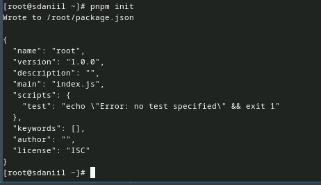{#fig:0010 width=100%}

9) Сконфигурим формат коммитов. Для этого добавим в файл package.json команду для формирования коммитов:  
"config": {  
    "commitizen": {  
       "path": "cz-conventional-changelog"  
    }  
}   
Таким образом, файл package.json приобретает вид: (рис. [-@fig:0011]).

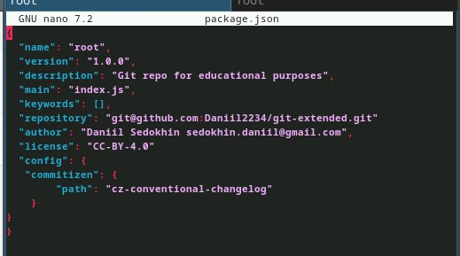{#fig:0011 width=100%}

10) Добавим новые файлы:  

git add .  

Выполним коммит:  

git cz  

Отправим на github:  

git push (рис. [-@fig:0012]).

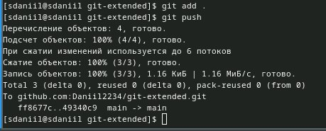{#fig:0012 width=100%}

11) Конфигурация git-flow  

    Инициализируем git-flow  

    git flow init (рис. [-@fig:0013]).

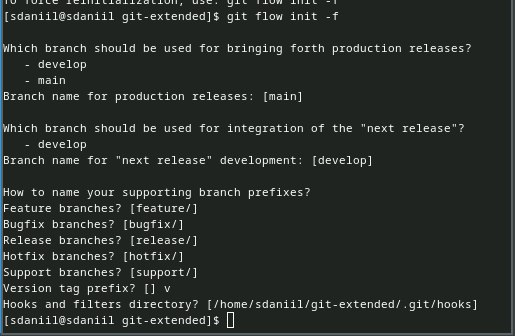{#fig:0013 width=100%}

12) Префикс для ярлыков установим в v.  

Проверьте, что Вы на ветке develop:  

git branch  

Загрузите весь репозиторий в хранилище:  

git push --all (рис. [-@fig:0014]).

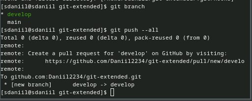{#fig:0014 width=100%}

13) Установите внешнюю ветку как вышестоящую для этой ветки:  

git branch --set-upstream-to=origin/develop develop (рис. [-@fig:0015]).

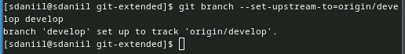{#fig:0015 width=100%}

14) Создадим релиз с версией 1.0.0  

git flow release start 1.0.0 (рис. [-@fig:0016]).

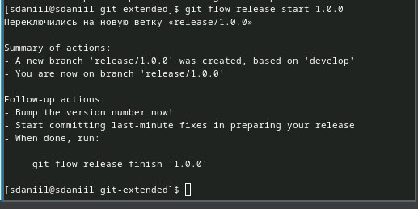{#fig:0016 width=100%}

15) Создадим журнал изменений  

standard-changelog --first-release  

Добавим журнал изменений в индекс  

git add CHANGELOG.md  
git commit -am 'chore(site): add changelog'  
Зальём релизную ветку в основную ветку  

git flow release finish 1.0.0 (рис. [-@fig:0018]).

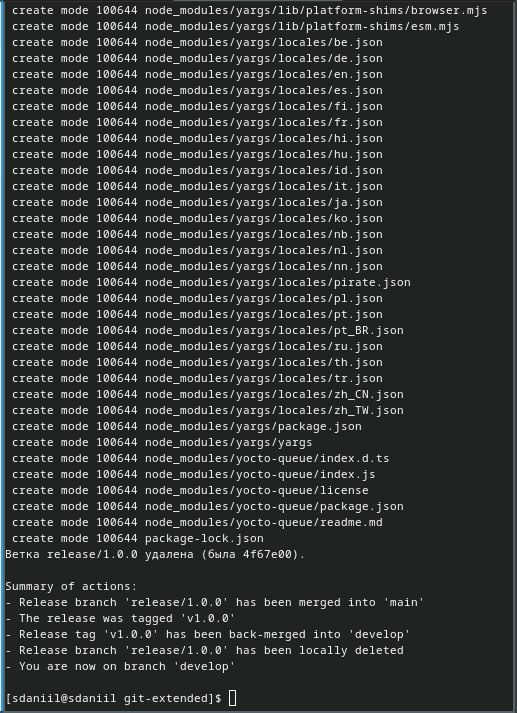{#fig:0018 width=100%}

16) Отправим данные на github  

git push --all  
git push --tags (рис. [-@fig:0019]). 

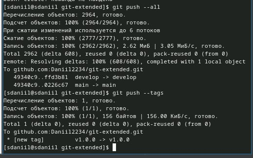{#fig:0019 width=100%}

17) Создадим релиз на github. Для этого будем использовать утилиты работы с github:  

gh release create v1.0.0 -F CHANGELOG.md (рис. [-@fig:0020]).

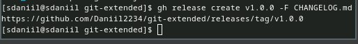{#fig:0020 width=100%}

18) Разработка новой функциональности  

    Создадим ветку для новой функциональности:  

    git flow feature start feature_branch (рис. [-@fig:0021]). 

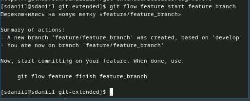{#fig:0021 width=100%}

19) Далее, продолжаем работу c git как обычно.  

По окончании разработки новой функциональности следующим шагом следует объединить ветку feature_branch c develop:  

git flow feature finish feature_branch (рис. [-@fig:0022]). 

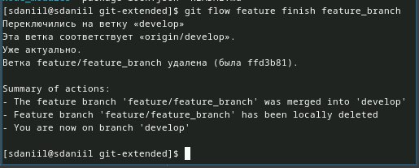{#fig:0022 width=100%}

20) Создание релиза git-flow  

    Создадим релиз с версией 1.2.3:  

    git flow release start 1.2.3 (рис. [-@fig:0023]). 

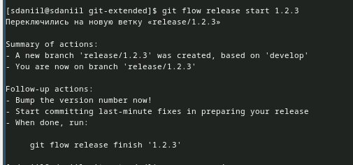{#fig:0023 width=100%}

21)     Обновим номер версии в файле package.json. Установите её в 1.2.3.  

    Создадим журнал изменений  

    standard-changelog (рис. [-@fig:0024]).
    
    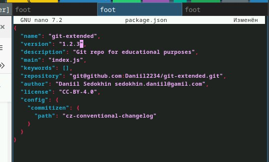{#fig:0024 width=100%}
    
22) Добавим журнал изменений в индекс  

git add CHANGELOG.md  
git commit -am 'chore(site): update changel  
Зальём релизную ветку в основную ветку  

git flow release finish 1.2.3 (рис. [-@fig:0025]).

  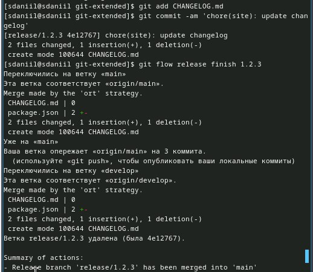{#fig:0025 width=100%}
    
23) Отправим данные на github  

git push --all  
git push --tags  

Создадим релиз на github с комментарием из журнала изменений:  

gh release create v1.2.3 -F CHANGELOG.md (рис. [-@fig:0026]).

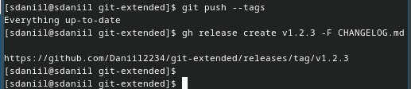{#fig:0026 width=100%}

# Выводы

Я Получил навыки правильной работы с репозиториями git.
    
    
    
