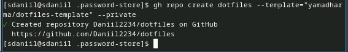

---
## Front matter
title: "Отчёт по лабораторной работе №5"
subtitle: "Настройка рабочей среды"
author: "Седохин Даниил Алексеевич"

## Generic otions
lang: ru-RU
toc-title: "Содержание"

## Bibliography
bibliography: bib/cite.bib
csl: pandoc/csl/gost-r-7-0-5-2008-numeric.csl

## Pdf output format
toc: true # Table of contents
toc-depth: 2
lof: true # List of figures
lot: false # List of tables
fontsize: 12pt
linestretch: 1.5
papersize: a4
documentclass: scrreprt
## I18n polyglossia
polyglossia-lang:
  name: russian
  options:
	- spelling=modern
	- babelshorthands=true
polyglossia-otherlangs:
  name: english
## I18n babel
babel-lang: russian
babel-otherlangs: english
## Fonts
mainfont: PT Serif
romanfont: PT Serif
sansfont: PT Sans
monofont: PT Mono
mainfontoptions: Ligatures=TeX
romanfontoptions: Ligatures=TeX
sansfontoptions: Ligatures=TeX,Scale=MatchLowercase
monofontoptions: Scale=MatchLowercase,Scale=0.9
## Biblatex
biblatex: true
biblio-style: "gost-numeric"
biblatexoptions:
  - parentracker=true
  - backend=biber
  - hyperref=auto
  - language=auto
  - autolang=other*
  - citestyle=gost-numeric
## Pandoc-crossref LaTeX customization
figureTitle: "Рис."
tableTitle: "Таблица"
listingTitle: "Листинг"
lofTitle: "Список иллюстраций"
lotTitle: "Список таблиц"
lolTitle: "Листинги"
## Misc options
indent: true
header-includes:
  - \usepackage{indentfirst}
  - \usepackage{float} # keep figures where there are in the text
  - \floatplacement{figure}{H} # keep figures where there are in the text
  
---

# Цель работы

Получение навыков настройки рабочей среды.

# Задание

   Настроить рабочую среду.
    
# Теоретическое введение
Менеджер паролей pass

    Менеджер паролей pass — программа, сделанная в рамках идеологии Unix.
    Также носит название стандартного менеджера паролей для Unix (The standard Unix password manager).

Основные свойства

    Данные хранятся в файловой системе в виде каталогов и файлов.
    Файлы шифруются с помощью GPG-ключа.

Структура базы паролей

    Структура базы может быть произвольной, если Вы собираетесь использовать её напрямую, без промежуточного программного обеспечения. Тогда семантику структуры базы данных Вы держите в своей голове.
    Если же необходимо использовать дополнительное программное обеспечение, необходимо семантику заложить в структуру базы паролей.

Семантическая структура базы паролей

    Рассмотрим пользователя user в домене example.com, порт 22.

    Отсутствие имени пользователя или порта в имени файла означает, что любое имя пользователя и порт будут совпадать:

    example.com.pgp

    Соответствующее имя пользователя может быть именем файла внутри каталога, имя которого совпадает с хостом. Это полезно, если в базе есть пароли для нескольких пользователей на одном хосте:

    example.com/user.pgp

    Имя пользователя также может быть записано в виде префикса, отделенного от хоста знаком @:

    user@example.com.pgp

    Соответствующий порт может быть указан после хоста, отделённый двоеточием (:):

    example.com:22.pgp
    example.com:22/user.pgp
    user@example.com:22.pgp

    Эти все записи могут быть расположены в произвольных каталогах, задающих Вашу собственную иерархию.

Реализации

Утилиты командной строки

    На данный момент существует 2 основных реализации:
        pass — классическая реализация в виде shell-скриптов (https://www.passwordstore.org/);
        gopass — реализация на go с дополнительными интегрированными функциями (https://www.gopass.pw/).
    Дальше в тексте будет использоваться программа pass, но всё то же самое можно сделать с помощью программы gopass.

Графические интерфейсы

    qtpass
        qtpass — может работать как графический интерфейс к pass, так и как самостоятельная программа. В настройках можно переключаться между использованием pass и gnupg.

    gopass-ui
        gopass-ui — интерфейс к gopass.

    webpass
        Репозиторий: https://github.com/emersion/webpass
        Веб-интерфейс к pass.
        Написано на golang.

Приложения для Android

    Password Store
        URL: https://play.google.com/store/apps/details?id=dev.msfjarvis.aps
        Репозиторий с кодом: https://github.com/android-password-store/Android-Password-Store
        Документация: https://android-password-store.github.io/docs/
        Для синхронизации с git необходимо импортировать ssh-ключи.
        Поддерживает разблокировку по биометрическим данным.
        Для работы требует наличия OpenKeychain: Easy PGP.

    OpenKeychain: Easy PGP
        URL: https://play.google.com/store/apps/details?id=org.sufficientlysecure.keychain
        Операции с ключами pgp.
        Необходимо будет импортировать pgp-ключи.
        Не поддерживает разблокировку по биометрическим данным. Необходимо набирать пароль ключа.

Пакеты для Emacs

    pass
        Основной режим для управления хранилищем и редактирования записей.
        Emacs. Пакет pass
        Репозиторий: https://github.com/NicolasPetton/pass
        Позволяет редактировать базу данных паролей.

        Запуск:

        M-x pass

    helm-pass
        Интерфейс helm для pass.
        Репозиторий: https://github.com/emacs-helm/helm-pass

        Запуск:

        M-x helm-pass

        Выдаёт в минибуфере список записей из базы паролей. При нажатии Enter копирует пароль в буфер.

    ivy-pass
        Интерфейс ivy для pass.
        Репозиторий: https://github.com/ecraven/ivy-pass

Управление файлами конфигурации

    Использование chezmoi для управления файлами конфигурации домашнего каталога пользователя.

Общая информация

    Сайт: https://www.chezmoi.io/
    Репозиторий: https://github.com/twpayne/chezmoi

Конфигурация chezmoi

Рабочие файлы

    Состояние файлов конфигурации сохраняется в каталоге

    ~/.local/share/chezmoi

    Он является клоном вашего репозитория dotfiles.
    Файл конфигурации ~/.config/chezmoi/chezmoi.toml (можно использовать также JSON или YAML) специфичен для локальной машины.
    Файлы, содержимое которых одинаково на всех ваших машинах, дословно копируются из исходного каталога.
    Файлы, которые варьируются от машины к машине, выполняются как шаблоны, обычно с использованием данных из файла конфигурации локальной машины для настройки конечного содержимого, специфичного для локальной машины.

    При запуске

    chezmoi apply

вычисляется желаемое содержимое и разрешения для каждого файла, а затем вносит необходимые изменения, чтобы ваши файлы соответствовали этому состоянию.

    По умолчанию chezmoi изменяет файлы только в рабочей копии.

Автоматически создавать файл конфигурации на новой машине

    При выполнении chezmoi init также может автоматически создать файл конфигурации, если он еще не существует.
    Если ваш репозиторий содержит файл с именем .chezmoi.$FORMAT.tmpl, где $FORMAT есть один из поддерживаемых форматов файла конфигурации (json, toml, или yaml), то chezmoi init выполнит этот шаблон для создания исходного файла конфигурации.

    Например, пусть ~/.local/share/chezmoi/.chezmoi.toml.tmpl выглядит так:

    {{- $email := promptStringOnce . "email" "Email address" -}}

    [data]
        email = {{ $email | quote }}

        При выполнении chezmoi init будет создан конфигурационный файл ~/.config/chezmoi/chezmoi.toml.
        promptStringOnce — это специальная функция, которая запрашивает у пользователя значение, если оно еще не установлено в разделе data конфигурационного файла.

    Чтобы протестировать этот шаблон, используйте chezmoi execute-template с флагами --init и --promptString, например:

    chezmoi execute-template --init --promptString email=me@home.org < ~/.local/share/chezmoi/.chezmoi.toml.tmpl

Пересоздание файл конфигурации

    Если вы измените шаблон файла конфигурации, chezmoi предупредит вас, если ваш текущий файл конфигурации не был сгенерирован из этого шаблона.

    Вы можете повторно сгенерировать файл конфигурации, запустив:

    chezmoi init

Шаблоны

Общая информация

    Шаблоны используются для изменения содержимого файла в зависимости от среды.
    Используется синтаксис шаблонов Go.
    Файл интерпретируется как шаблон, если выполняется одно из следующих условий:
        имя файла имеет суффикс .tmpl;
        файл находится в каталоге .chezmoitemplates.

Данные шаблона

    Полный список переменных шаблона:

    chezmoi data

    Источники переменных:
        файлы .chezmoi, например, .chezmoi.os;
        файлы конфигурации .chezmoidata.$FORMAT. Форматы (json, jsonc, toml, yaml) читаются в алфавитном порядке;
        раздел data конфигурационного файла.

Способы создания файла шаблона

    При первом добавлении файла передайте аргумент --template:

    chezmoi add --template ~/.zshrc

    Если файл уже контролируется chezmoi, но не является шаблоном, можно сделать его шаблоном:

    chezmoi chattr +template ~/.zshrc

    Можно создать шаблон вручную в исходном каталоге, присвоив ему расширение .tmpl:

    chezmoi cd
    $EDITOR dot_zshrc.tmpl

    Шаблоны в каталоге .chezmoitemplates должны создаваться вручную:

    chezmoi cd
    mkdir -p .chezmoitemplates
    cd .chezmoitemplates
    $EDITOR mytemplate

Редактирование файла шаблона

    Используйте chezmoi edit:

    chezmoi edit ~/.zshrc

    Чтобы сделанные вами изменения сразу же применялись после выхода из редактора, используйте опцию --apply:

    chezmoi edit --apply ~/.zshrc

Тестирование шаблонов

    Тестирование с помощью команды chezmoi execute-template.

    Тестирование небольших фрагментов шаблонов:

    chezmoi execute-template '{{ .chezmoi.hostname }}'

    Тестирование целых файлов:

    chezmoi cd
    chezmoi execute-template < dot_zshrc.tmpl

Синтаксис шаблона

    Действия шаблона записываются внутри двойных фигурных скобок, {{ }}.
    Действия могут быть переменными, конвейерами или операторами управления.
    Текст вне действий копируется буквально.

    Переменные записываются буквально:

    {{ .chezmoi.hostname }}

    Условные выражения могут быть записаны с использованием if, else if, else, end:

    {{ if eq .chezmoi.os "darwin" }}
    darwin

    {{ else if eq .chezmoi.os "linux" }}
    linux

    {{ else }}
    other operating system

    {{ end }}

    Удаление пробелов

        Для удаления проблем в шаблоне разместите знак минус и пробела рядом со скобками:

        HOSTNAME={{- .chezmoi.hostname }}

        В результате получим:

        HOSTNAME=myhostname

    Отладка шаблона

        Используется подкоманда execute-template:

        chezmoi execute-template '{{ .chezmoi.os }}/{{ .chezmoi.arch }}'

        Интерпретируются любые данные, поступающие со стандартного ввода или в конце команды.

        Можно передать содержимое файла этой команде:

        cat foo.txt | chezmoi execute-template

    Логические операции
        Возможно выполнение логических операций.

        Если имя хоста машины равно work-laptop, текст между if и end будет включён в результат:

        # common config
        export EDITOR=vi

        # machine-specific configuration
        {{- if eq .chezmoi.hostname "work-laptop" }}
        # this will only be included in ~/.bashrc on work-laptop
        {{- end }}

        Логические функции
            eq: возвращает true, если первый аргумент равен любому из остальных аргументов, может принимать несколько аргументов;
            not: возвращает логическое отрицание своего единственного аргумента;
            and: возвращает логическое И своих аргументов, может принимать несколько аргументов;
            or: возвращает логическое ИЛИ своих аргументов, может принимать несколько аргументов.

        Целочисленные функции
            len: возвращает целочисленную длину своего аргумента;
            eq: возвращает логическую истину arg1 == arg2;
            ne: возвращает логическое значение arg1 != arg2;
            lt: возвращает логическую истину arg1 < arg2;
            le: возвращает логическую истину arg1 <= arg2;
            gt: возвращает логическую истину arg1 > arg2;
            ge: возвращает логическую истину arg1 >= arg2.

Переменные шаблона

    Чтобы просмотреть переменные, доступные в вашей системе, выполните:

    chezmoi data

    Чтобы получить доступ к переменной chezmoi.kernel.osrelease в шаблоне, используйте:

    {{ .chezmoi.kernel.osrelease }}

# Выполнение лабораторной работы

1)  Установка  
 Установим pass и gopass (рис. [-@fig:001] [-@fig:002]).

{#fig:001 width=100%}

{#fig:002 width=100%}

2) Настройка  

Ключи GPG  

    Просмотр списка ключей:  

    gpg --list-secret-keys (рис. [-@fig:003]).

{#fig:003 width=100%}

3) Инициализация хранилища  

    Инициализируем хранилище:  

    pass init <gpg-id or email> (рис. [-@fig:004]).

{#fig:004 width=100%}

4) Синхронизация с git  

    Создадим структуру git:  

pass git init (рис. [-@fig:005])

{#fig:005 width=100%}

5) Также можно задать адрес репозитория на хостинге (репозиторий необходимо предварительно создать):  

pass git remote add origin git@github.com:<git_username>/<git_repo>.git (рис. [-@fig:006]).

{#fig:006 width=100%}

6) Для синхронизации выполняется следующая команда:  

pass git pull  
pass git push (рис. [-@fig:007]).

           
{#fig:007 width=100%}

7) Прямые изменения  

    Следует заметить, что отслеживаются только изменения, сделанные через сам gopass (или pass).  

    Если изменения сделаны непосредственно на файловой системе, необходимо вручную закоммитить и выложить изменения:  

    cd ~/.password-store/  
    git add .  
    git commit -am 'edit manually'  
    git push (рис. [-@fig:008]).

{#fig:008 width=100%}

8) Проверить статус синхронизации модно командой  

pass git status (рис. [-@fig:009]).

{#fig:009 width=100%}

9) Настройка интерфейса с броузером  

    Для взаимодействия с броузером используется интерфейс native messaging.  
    Поэтому кроме плагина к броузеру устанавливается программа, обеспечивающая интерфейс native messaging.  

    Плагин browserpass  
        Репозиторий: https://github.com/browserpass/browserpass-extension
        Плагин для брoузера
            Плагин для Firefox: https://addons.mozilla.org/en-US/firefox/addon/browserpass-ce/.
            Плагин для Chrome/Chromium: https://chrome.google.com/webstore/detail/browserpass-ce/naepdomgkenhinolocfifgehidddafch.

        Интерфейс для взаимодействия с броузером (native messaging)
            Репозиторий: https://github.com/browserpass/browserpass-native

            Gentoo:

            emerge www-plugins/browserpass

            Fedora

            dnf copr enable maximbaz/browserpass
            dnf install browserpass

 (рис. [-@fig:0010] [-@fig:0011]).

{#fig:0010 width=100%}

{#fig:0011 width=100%}

10) Сохранение пароля  

    Добавить новый пароль  

        Выполним:

        pass insert [OPTIONAL DIR]/[FILENAME]
 (рис. [-@fig:0012]).

{#fig:0012 width=100%}

11) 
    OPTIONAL DIR: необязательное имя каталога, определяющее файловую структуру для вашего хранилища паролей;
    FILENAME: имя файла, который будет использоваться для хранения пароля.

Отобразите пароль для указанного имени файла:

pass [OPTIONAL DIR]/[FILENAME]

Замените существующий пароль:

pass generate --in-place FILENAME (рис. [-@fig:0013]).

{#fig:0013 width=100%}

12) Установите дополнительное программное обеспечение:  

sudo dnf -y install \  
     dunst \  
     fontawesome-fonts \  
     powerline-fonts \  
     light \  
     fuzzel \  
     swaylock \  
     kitty \  
     waybar swaybg \  
     wl-clipboard \  
     mpv \  
     grim \  
     slurp (рис. [-@fig:0014]).

{#fig:0014 width=100%}

13) Установим шрифты:  

sudo dnf copr enable peterwu/iosevka  
sudo dnf search iosevka  
sudo dnf install iosevka-fonts iosevka-aile-fonts iosevka-curly-fonts iosevka-slab-fonts iosevka-etoile-fonts iosevka-term-fonts (рис. [-@fig:0015] [-@fig:0016]).

{#fig:0015 width=100%}

{#fig:0016 width=100%}

15) 

    Установка бинарного файла. Скрипт определяет архитектуру процессора и операционную систему и скачивает необходимый файл:  

        с помощью wget:

        sh -c "$(wget -qO- chezmoi.io/get)"

 (рис. [-@fig:0017]).

{#fig:0017 width=100%}

16) Создание собственного репозитория с помощью утилит  

    Будем использовать утилиты командной строки для работы с github.  

    Создадим свой репозиторий для конфигурационных файлов на основе шаблона:  

    gh repo create dotfiles --template="yamadharma/dotfiles-template" --private [-@fig:0018]). 

{#fig:0018 width=100%}

17) Подключение репозитория к своей системе  

    Инициализируйте chezmoi с вашим репозиторием dotfiles:  

    chezmoi init git@github.com:<username>/dotfiles.git
 (рис. [-@fig:0019]).

{#fig:0019 width=100%}

18) Проверим, какие изменения внесёт chezmoi в домашний каталог, запустив: (рис. [-@fig:0020]). 

{#fig:0020 width=100%}

19) Запуск:  

chezmoi apply -v  (рис. [-@fig:0021]). 

{#fig:0021 width=100%}

20)  Использование chezmoi на нескольких машинах  

    На второй машине инициализируйте chezmoi с вашим репозиторием dotfiles:  

    chezmoi init https://github.com/<username>/dotfiles.git  

    Или через ssh:  

    chezmoi init git@github.com:<username>/dotfiles.git
 (рис. [-@fig:0022]). 

{#fig:0022 width=100%}

21)   Проверим, какие изменения внесёт chezmoi в домашний каталог, запустив:  

chezmoi diff (рис. [-@fig:0023]).
    
    {#fig:0023 width=100%}
    
22) Запустим  

chezmoi apply -v (рис. [-@fig:0024]).

  {#fig:0024 width=100%}
    
23) При существующем каталоге chezmoi можно получить и применить последние изменения из вашего репозитория:  

chezmoi update -v  (рис. [-@fig:0025]).

{#fig:0025 width=100%}

24) Настройка новой машины с помощью одной команды  

    Можно установить свои dotfiles на новый компьютер с помощью одной команды:  

    chezmoi init --apply https://github.com/<username>/dotfiles.git  
    
    Через ssh:  

chezmoi init --apply git@github.com:<username>/dotfiles.git
(рис. [-@fig:0026]).

{#fig:0026 width=100%}

25)Ежедневные операции c chezmoi  

    Извлеките последние изменения из репозитория и примените их  

        Можно извлечь изменения из репозитория и применить их одной командой:

        chezmoi update (рис. [-@fig:0027]).

  {#fig:0027 width=100%}
  
  Это запускается git pull --autostash --rebase в вашем исходном каталоге, а затем chezmoi apply.

26) Извлеките последние изменения из своего репозитория и посмотрите, что изменится, фактически не применяя изменения  

    Выполним:  

    chezmoi git pull -- --autostash --rebase && chezmoi diff  

    Это запускается git pull --autostash --rebase в вашем исходном каталоге, а chezmoi diff затем показывает разницу между целевым состоянием, вычисленным из вашего исходного каталога, и фактическим состоянием.  

    Если вы довольны изменениями, вы можете применить их:  

    chezmoi apply (рис. [-@fig:0028]).

{#fig:0028 width=100%}

27) Автоматически фиксируйте и отправляйте изменения в репозиторий  

    Можно автоматически фиксировать и отправлять изменения в исходный каталог в репозиторий.  
    Эта функция отключена по умолчанию.  

    Чтобы включить её, добавьте в файл конфигурации ~/.config/chezmoi/chezmoi.toml следующее:  

    [git]
        autoCommit = true
        autoPush = true

    Всякий раз, когда в исходный каталог вносятся изменения, chezmoi фиксирует изменения с помощью автоматически сгенерированного сообщения фиксации и отправляет их в ваш репозиторий.  
    Будьте осторожны при использовании autoPush. Если ваш репозиторий dotfiles является общедоступным, и вы случайно добавили секрет в виде обычного текста, этот секрет будет отправлен в ваш общедоступный репозиторий. (рис. [-@fig:0029]).

{#fig:0029 width=100%}

# Выводы

Я Получил навыки настройки рабочей среды.
    
    
    
