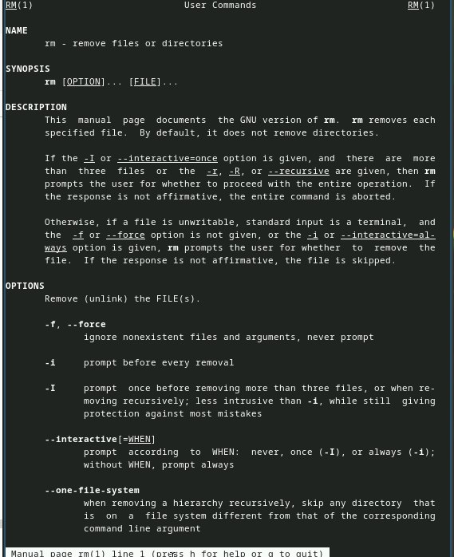

---
## Front matter
title: "Отчёт по лабораторной работе №6"
subtitle: "Основы интерфейса взаимодействия
пользователя с системой Unix на уровне командной строки"
author: "Седохин Даниил Алексеевич"

## Generic otions
lang: ru-RU
toc-title: "Содержание"

## Bibliography
bibliography: bib/cite.bib
csl: pandoc/csl/gost-r-7-0-5-2008-numeric.csl

## Pdf output format
toc: true # Table of contents
toc-depth: 2
lof: true # List of figures
lot: false # List of tables
fontsize: 12pt
linestretch: 1.5
papersize: a4
documentclass: scrreprt
## I18n polyglossia
polyglossia-lang:
  name: russian
  options:
	- spelling=modern
	- babelshorthands=true
polyglossia-otherlangs:
  name: english
## I18n babel
babel-lang: russian
babel-otherlangs: english
## Fonts
mainfont: PT Serif
romanfont: PT Serif
sansfont: PT Sans
monofont: PT Mono
mainfontoptions: Ligatures=TeX
romanfontoptions: Ligatures=TeX
sansfontoptions: Ligatures=TeX,Scale=MatchLowercase
monofontoptions: Scale=MatchLowercase,Scale=0.9
## Biblatex
biblatex: true
biblio-style: "gost-numeric"
biblatexoptions:
  - parentracker=true
  - backend=biber
  - hyperref=auto
  - language=auto
  - autolang=other*
  - citestyle=gost-numeric
## Pandoc-crossref LaTeX customization
figureTitle: "Рис."
tableTitle: "Таблица"
listingTitle: "Листинг"
lofTitle: "Список иллюстраций"
lotTitle: "Список таблиц"
lolTitle: "Листинги"
## Misc options
indent: true
header-includes:
  - \usepackage{indentfirst}
  - \usepackage{float} # keep figures where there are in the text
  - \floatplacement{figure}{H} # keep figures where there are in the text
  
---

# Цель работы

Приобретение практических навыков взаимодействия пользователя с системой по-
средством командной строки.

# Задание

   Приобрести практические навыки работы пользователя с системой посредством командной строки

# Выполнение лабораторной работы

1) Определим полное имя домашнего каталога. (рис. [-@fig:001]).

{#fig:001 width=100%}

2) Перейдем в каталог /tmp   
Выведем на экран содержимое каталога /tmp. Для этого используйте команду ls
с различными опциями  (рис. [-@fig:002] [-@fig:003]).

{#fig:002 width=100%}

{#fig:003 width=100%}

3)Определим, есть ли в каталоге /var/spool подкаталог с именем cron? (рис. [-@fig:004]).

{#fig:004 width=100%}

4) Перейдем в свой домашний каталог и выведем на экран его содержимое. (рис. [-@fig:005])

{#fig:005 width=100%}

5) В домашнем каталоге создадим новый каталог с именем newdir. В каталоге ~/newdir создадим новый каталог с именем morefun. (рис. [-@fig:006]).

{#fig:006 width=100%}

6) В домашнем каталоге создадим одной командой три новых каталога с именами
letters, memos, misk. Затем удалим эти каталоги одной командой. (рис. [-@fig:007]).

           
{#fig:007 width=100%}

7) Попробуем удалить ранее созданный каталог ~/newdir командой rm.  
 Удалим каталог ~/newdir/morefun из домашнего каталога. (рис. [-@fig:008]).

{#fig:008 width=100%}

8) С помощью команды man определим, какую опцию команды ls нужно использо-
вать для просмотра содержимое не только указанного каталога, но и подкаталогов,
входящих в него. (рис. [-@fig:009] [-@fig:0010] [-@fig:0011]).

{#fig:009 width=100%}

{#fig:0010 width=100%}

{#fig:0011 width=100%}

9) С помощью команды man определии набор опций команды ls, позволяющий отсорти-
ровать по времени последнего изменения выводимый список содержимого каталога
с развёрнутым описанием файлов (рис. [-@fig:0012]).

{#fig:0012 width=100%}

10) Используем команду man для просмотра описания следующих команд: cd, pwd, mkdir,
rmdir, rm. (рис. [-@fig:0013]). (рис. [-@fig:0014]). (рис. [-@fig:0015]). (рис. [-@fig:0016]). (рис. [-@fig:0017]).

{#fig:0013 width=100%}

{#fig:0014 width=100%}

{#fig:0015 width=100%}

{#fig:0016 width=100%}

{#fig:0017 width=100%}

11) Используя информацию, полученную при помощи команды history, выполним мо-
дификацию и исполнение нескольких команд из буфера команд. (рис. [-@fig:0018] [-@fig:0019]).

{#fig:0018 width=100%}

{#fig:0019 width=100%}

# Выводы

Я приобрел практические навыки взаимодействия пользователя с системой по-
средством командной строки.
    
    
