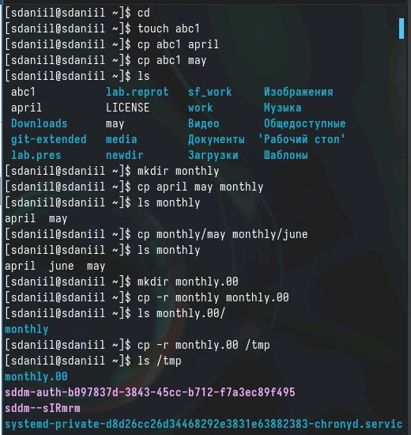

---
## Front matter
lang: ru-RU
title: Лабораторная работа №7
subtitle: Анализ файловой системы Linux.
author:
  - Седохин Д.А.  
institute:
  - Российский университет дружбы народов, Москва, Россия  
  - 23 марта 2024  

## i18n babel
babel-lang: russian
babel-otherlangs: english

## Formatting pdf
toc: false
toc-title: Содержание
slide_level: 2
aspectratio: 169
section-titles: true
theme: metropolis
header-includes:
 - \metroset{progressbar=frametitle,sectionpage=progressbar,numbering=fraction}
 - '\makeatletter'
 - '\beamer@ignorenonframefalse'
 - '\makeatother'
 
##Fonts 
mainfont: PT Serif 
romanfont: PT Serif 
sansfont: PT Sans 
monofont: PT Mono 
mainfontoptions: Ligatures=TeX 
romanfontoptions: Ligatures=TeX 
sansfontoptions: Ligatures=TeX,Scale=MatchLowercase 
monofontoptions: Scale=MatchLowercase,Scale=0.9
---

# Информация

## Докладчик

:::::::::::::: {.columns align=center}
::: {.column width="70%"}

  * Седохин Даниил Алексееивч
  * Группа НПИбд-02-23
  * Российский университет дружбы народов
  * <https://github.com/Daniil2234>

:::
::: {.column width="30%"}

:::
::::::::::::::

# Вводная часть

## Объект и предмет исследования

## Цель работы

- Ознакомление с файловой системой Linux, её структурой, именами и содержанием
каталогов. 
- Приобретение практических навыков по применению команд для работы
с файлами и каталогами

## Копирование файлов и каталогов
- Копирование файлов и каталогов 

{width=50%}

## Перемещение и переименование файлов и каталогов
- Перемещение и переименование файлов и каталогов

{width=50%}

## Изменение прав доступа

{width=60%}

## Создание директории, перемещение и переименование

{width=60%}

## Определение команды chmod

{width=60%}

## Упражнения лабораторной работы

{width=60%}

## Чтение man по командам mount, fsck, mskf, kill.
- mount
- fsck
- mskf
- kill

{width=40%}

{width=40%}

{width=40%}

## Вывод
- Я ознакомился с файловой системой Linux, её структурой, именами и содержанием
каталогов. 
- Я приобрел практические навыки по применению команд для работы с файлами и каталогами
