---
## Front matter
title: "Отчёт по лабораторной работе №7"
subtitle: "Анализ файловой системы Linux.
Команды для работы с файлами и каталогами"
author: "Седохин Даниил Алексеевич"

## Generic otions
lang: ru-RU
toc-title: "Содержание"

## Bibliography
bibliography: bib/cite.bib
csl: pandoc/csl/gost-r-7-0-5-2008-numeric.csl

## Pdf output format
toc: true # Table of contents
toc-depth: 2
lof: true # List of figures
lot: false # List of tables
fontsize: 12pt
linestretch: 1.5
papersize: a4
documentclass: scrreprt
## I18n polyglossia
polyglossia-lang:
  name: russian
  options:
	- spelling=modern
	- babelshorthands=true
polyglossia-otherlangs:
  name: english
## I18n babel
babel-lang: russian
babel-otherlangs: english
## Fonts
mainfont: PT Serif
romanfont: PT Serif
sansfont: PT Sans
monofont: PT Mono
mainfontoptions: Ligatures=TeX
romanfontoptions: Ligatures=TeX
sansfontoptions: Ligatures=TeX,Scale=MatchLowercase
monofontoptions: Scale=MatchLowercase,Scale=0.9
## Biblatex
biblatex: true
biblio-style: "gost-numeric"
biblatexoptions:
  - parentracker=true
  - backend=biber
  - hyperref=auto
  - language=auto
  - autolang=other*
  - citestyle=gost-numeric
## Pandoc-crossref LaTeX customization
figureTitle: "Рис."
tableTitle: "Таблица"
listingTitle: "Листинг"
lofTitle: "Список иллюстраций"
lotTitle: "Список таблиц"
lolTitle: "Листинги"
## Misc options
indent: true
header-includes:
  - \usepackage{indentfirst}
  - \usepackage{float} # keep figures where there are in the text
  - \floatplacement{figure}{H} # keep figures where there are in the text
  
---

# Цель работы

Ознакомление с файловой системой Linux, её структурой, именами и содержанием
каталогов. Приобретение практических навыков по применению команд для работы
с файлами и каталогами, по управлению процессами (и работами), по проверке исполь-
зования диска и обслуживанию файловой системы.

# Выполнение лабораторной работы

1) Копирование файла в текущем каталоге. Скопировать файл ~/abc1 в файл april
и в файл may:  
1 cd  
2 touch abc1  
3 cp abc1 april  
4 cp abc1 may  
1.1) Копирование нескольких файлов в каталог. Скопировать файлы april и may в каталог
monthly:  
1 mkdir monthly  
2 cp april may monthly  
1.2) Копирование файлов в произвольном каталоге. Скопировать файл monthly/may в файл 
с именем june:  
1 cp monthly/may monthly/june  
2 ls monthly  
Опция i в команде cp выведет на экран запрос подтверждения о перезаписи файла.
Для рекурсивного копирования каталогов, содержащих файлы, используется команда
cp с опцией r.  
Примеры  
1.3) Копирование каталогов в текущем каталоге. Скопировать каталог monthly в каталог
monthly.00:  
1 mkdir monthly.00  
2 cp -r monthly monthly.00  
1.4) Копирование каталогов в произвольном каталоге. Скопировать каталог monthly.00
в каталог /tmp  
1 cp -r monthly.00 /tmp (рис. [-@fig:001]).

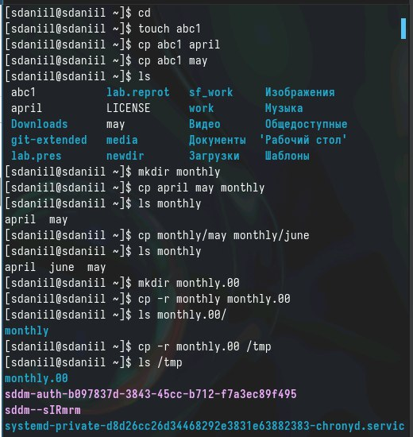{#fig:001 width=100%}

2) Перемещение и переименование файлов и каталогов  
Команды mv и mvdir предназначены для перемещения и переименования файлов
и каталогов.  
Формат команды mv:  
1 mv [-опции] старый_файл новый_файл  
Примеры:  
1. Переименование файлов в текущем каталоге. Изменить название файла april на
july в домашнем каталоге:  
1 cd  
2 mv april july  
2. Перемещение файлов в другой каталог. Переместить файл july в каталог monthly.00:  
1 mv july monthly.00  
2 ls monthly.00  
Результат:  
1 april july june may  
Если необходим запрос подтверждения о перезаписи файла, то нужно использовать 
опцию i.  
3. Переименование каталогов в текущем каталоге. Переименовать каталог monthly.00
в monthly.01  
1 mv monthly.00 monthly.01  
4. Перемещение каталога в другой каталог. Переместить каталог monthly.01в каталог
reports:  
1 mkdir reports  
2 mv monthly.01 reports  
5. Переименование каталога, не являющегося текущим. Переименовать каталог
reports/monthly.01 в reports/monthly:  
1 mv reports/monthly.01 reports/monthly  (рис. [-@fig:002]).

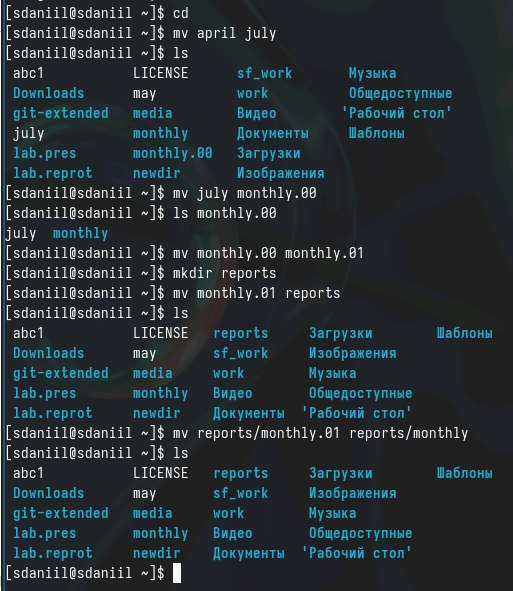{#fig:002 width=100%}

3)1. Требуется создать файл ~/may с правом выполнения для владельца:  
1 cd  
2 touch may  
3 ls -l may  
4 chmod u+x may  
5 ls -l may  
2. Требуется лишить владельца файла ~/may права на выполнение:  
1 chmod u-x may  
2 ls -l may  
3. Требуется создать каталог monthly с запретом на чтение для членов группы и всех
остальных пользователей:  
1 cd  
2 mkdir monthly  
3 chmod g-r, o-r monthly  
4. Требуется создать файл ~/abc1 с правом записи для членов группы:  
1 cd  
2 touch abc1  
3 chmod g+w abc1 (рис. [-@fig:003]).

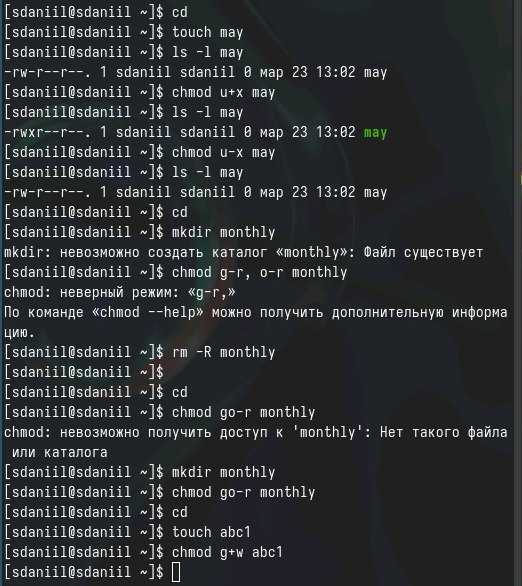{#fig:003 width=100%}

4) Скопируем файл /usr/include/sys/io.h в домашний каталог и назовем его
equipment. Если файла io.h нет, то используем любой другой файл в каталоге
/usr/include/sys/ вместо него. (рис. [-@fig:004])

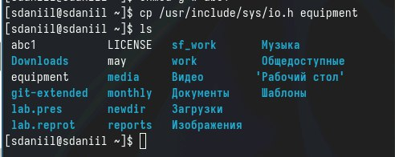{#fig:004 width=100%}

5) В домашнем каталоге создадим директорию ~/ski.plases.  
 Переместм файл equipment в каталог ~/ski.plases.  
 Переименуем файл ~/ski.plases/equipment в ~/ski.plases/equiplist. (рис. [-@fig:005]).

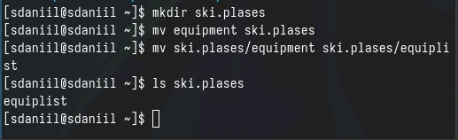{#fig:005 width=100%}

6) Создадим в домашнем каталоге файл abc1 и скопируем его в каталог
~/ski.plases, назовем его equiplist2.
Создадим каталог с именем equipment в каталоге ~/ski.plases. (рис. [-@fig:006]).
           
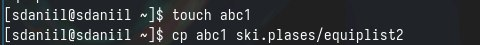{#fig:006 width=100%}

7) Переместим файлы ~/ski.plases/equiplist и equiplist2 в каталог
~/ski.plases/equipment. (рис. [-@fig:007]).

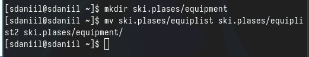{#fig:007 width=100%}

8) Создадим и переместим каталог ~/newdir в каталог ~/ski.plases и назовем
его plans. (рис. [-@fig:008]).

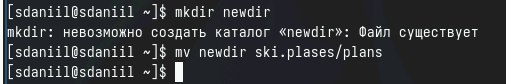{#fig:008 width=100%}

9)Определим опции команды chmod, необходимые для того, чтобы присвоить перечисленным ниже файлам выделенные права доступа, считая, что в начале таких прав
нет:  
 drwxr--r-- ... australia  
 drwx--x--x ... play  
 -r-xr--r-- ... my_os  
 -rw-rw-r-- ... feathers (рис. [-@fig:009]).

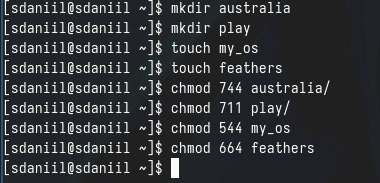{#fig:009 width=100%}

10) Просмотрим содержимое файла /etc/passwd (рис. [-@fig:0010]).

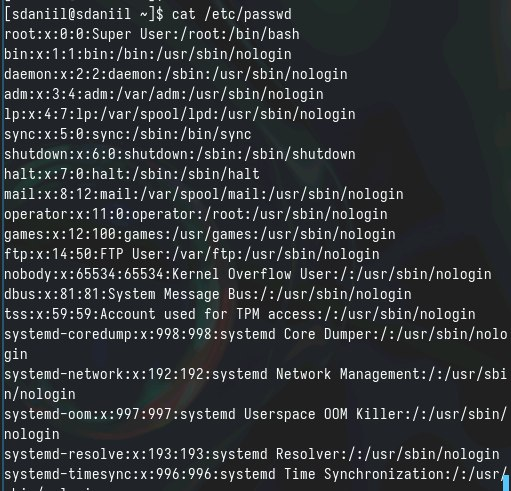{#fig:0010 width=100%}

11) Скопируем файл ~/feathers в файл ~/file.old.  
Переместим файл ~/file.old в каталог ~/play.  
 Скопируем каталог ~/play в каталог ~/fun.  
 Переместим каталог ~/fun в каталог ~/play и назовем его games.  
 Лишим владельца файла ~/feathers права на чтение.  
 В результате попытки просмотра файла нам отказано в доступе ~/eathers  
 Дадим владельцу файла ~/feathers право на чтение.
 Лишим владельца каталога ~/play права на выполнение.
 Перейдем в каталог ~/play. В результате нам отказано в доступе
 Дадим владельцу каталога ~/play право на выполнение. (рис. [-@fig:0011]).

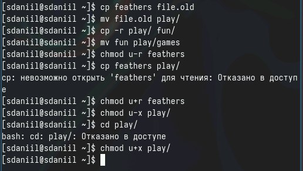{#fig:0011 width=100%}

12) Прочитаем man по командам mount, fsck, mskf, kill. (рис. [-@fig:0012] [-@fig:0013] [-@fig:0014] [-@fig:0015] ).

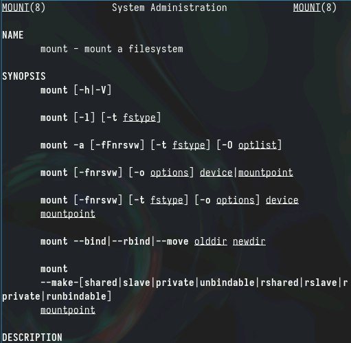{#fig:0012 width=100%}

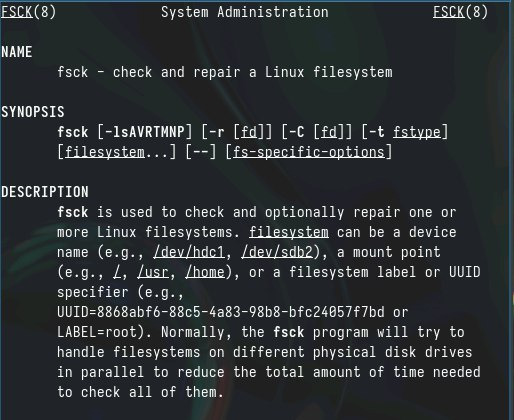{#fig:0013 width=100%}

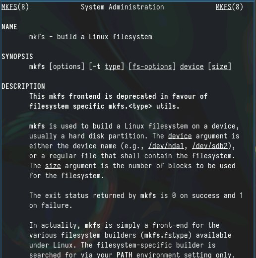{#fig:0014 width=100%}

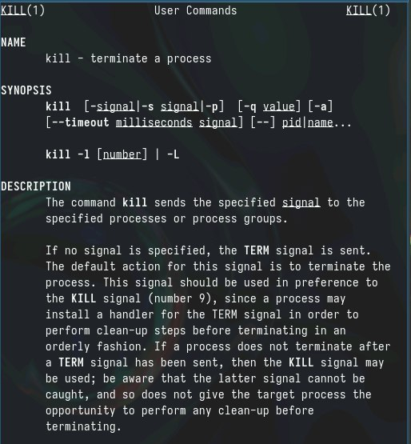{#fig:0015 width=100%}

# Контрольные вопросы

1. На моем компьютере используются несколько файловых систем. Например, на жестком диске есть файловая система NTFS, которая обладает хорошей поддержкой различных функций и контроля доступа к файлам. Также есть файловая система FAT32, которая поддерживается многими устройствами, но имеет ограничения на размер файлов и разделов. Кроме того, используется файловая система ext4, распространенная в Linux и обладающая хорошей производительностью и надежностью.  
2. Общая структура файловой системы включает в себя директории, файлы и разделы. На первом уровне структуры обычно располагаются директории, такие как "home" (домашние папки пользователей), "bin" (папка с исполняемыми файлами), "etc" (конфигурационные файлы), "var" (переменные данные), "tmp" (временные файлы).  
3. Для того чтобы содержимое файловой системы стало доступно операционной системе, необходимо выполнить операцию монтирования (mount), которая подключит файловую систему к дереву каталогов операционной системы.  
4. Основными причинами нарушения целостности файловой системы могут быть сбои в питании, ошибки записи/чтения данных, вирусы или повреждения файлов сторонними программами. Для устранения повреждений файловой системы можно использовать инструменты проверки и восстановления данных, такие как fsck в Linux.  
5. Файловая система создается путем форматирования раздела на диске, то есть установки определенного типа файловой системы на этот раздел. Например, при создании файловой системы ext4 на разделе используется команда mkfs.ext4.  
6. Для просмотра текстовых файлов в Linux часто используются команды cat, less, more, head, tail. Например, команда cat выводит содержимое файла на экран, команда less позволяет просматривать файл постранично.  
7. Основные возможности команды cp в Linux включают копирование файлов и директорий с сохранением их атрибутов и разрешений, создание копий файлов, а также возможность рекурсивного копирования для директорий.  
8. Команда mv в Linux используется для перемещения файлов и директорий из одного места в другое. При перемещении файлов с помощью mv, информация о файле остается неизменной, но путь к нему меняется.  
9. Права доступа определяют, какие операции пользователи и группы могут выполнять с файлами и директориями. Права доступа могут быть изменены с помощью команды chmod в Linux, позволяющей устанавливать различные разрешения на чтение, запись и выполнение для владельца файла, группы и других пользователей.

# Выводы

Я ознакомился с файловой системой Linux, её структурой, именами и содержанием
каталогов. Приобрел практическе навыки по применению команд для работы
с файлами и каталогами, по управлению процессами (и работами), по проверке исполь-
зования диска и обслуживанию файловой системы.
    
