---
## Front matter
title: "Отчёт по лабораторной работе №9"
subtitle: "Командная оболочка Midnight Commander"
author: "Седохин Даниил Алексеевич"

## Generic otions
lang: ru-RU
toc-title: "Содержание"

## Bibliography
bibliography: bib/cite.bib
csl: pandoc/csl/gost-r-7-0-5-2008-numeric.csl

## Pdf output format
toc: true # Table of contents
toc-depth: 2
lof: true # List of figures
lot: false # List of tables
fontsize: 12pt
linestretch: 1.5
papersize: a4
documentclass: scrreprt
## I18n polyglossia
polyglossia-lang:
  name: russian
  options:
	- spelling=modern
	- babelshorthands=true
polyglossia-otherlangs:
  name: english
## I18n babel
babel-lang: russian
babel-otherlangs: english
## Fonts
mainfont: PT Serif
romanfont: PT Serif
sansfont: PT Sans
monofont: PT Mono
mainfontoptions: Ligatures=TeX
romanfontoptions: Ligatures=TeX
sansfontoptions: Ligatures=TeX,Scale=MatchLowercase
monofontoptions: Scale=MatchLowercase,Scale=0.9
## Biblatex
biblatex: true
biblio-style: "gost-numeric"
biblatexoptions:
  - parentracker=true
  - backend=biber
  - hyperref=auto
  - language=auto
  - autolang=other*
  - citestyle=gost-numeric
## Pandoc-crossref LaTeX customization
figureTitle: "Рис."
tableTitle: "Таблица"
listingTitle: "Листинг"
lofTitle: "Список иллюстраций"
lotTitle: "Список таблиц"
lolTitle: "Листинги"
## Misc options
indent: true
header-includes:
  - \usepackage{indentfirst}
  - \usepackage{float} # keep figures where there are in the text
  - \floatplacement{figure}{H} # keep figures where there are in the text
  
---

# Цель работы

Освоение основных возможностей командной оболочки Midnight Commander. Приобретение навыков практической работы по просмотру каталогов и файлов; манипуляций
с ними.

# Выполнение лабораторной работы

1)  Изучите информацию о mc, вызвав в командной строке man mc. (рис. [-@fig:001]).

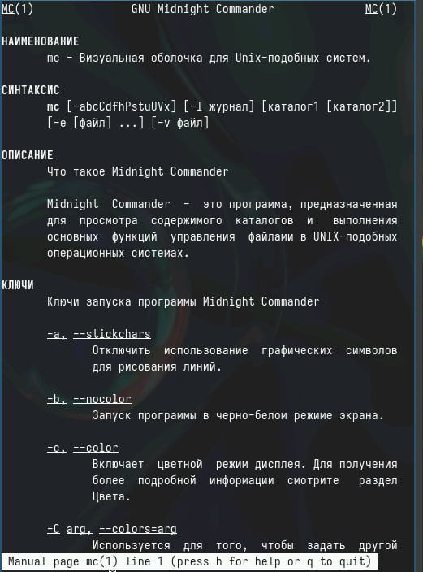{#fig:001 width=100%}

2) Запустите из командной строки mc, изучите его структуру и меню.  (рис. [-@fig:002]).

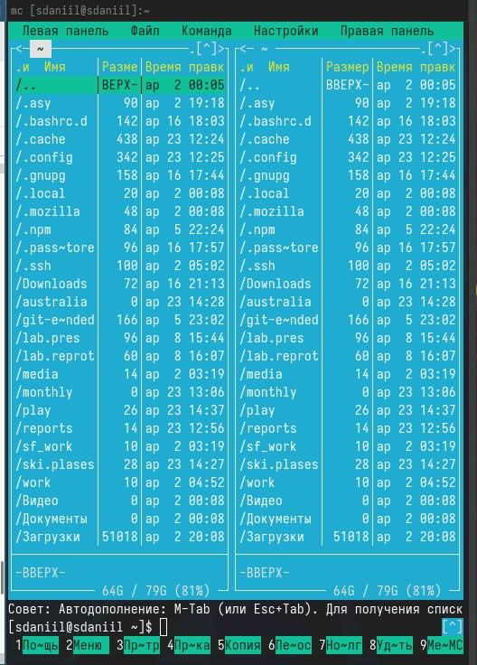{#fig:002 width=100%}

3)Выполните несколько операций в mc, используя управляющие клавиши (операции
с панелями; выделение/отмена выделения файлов, копирование/перемещение фай-
лов, получение информации о размере и правах доступа на файлы и/или каталоги
и т.п.) (рис. [-@fig:003]).

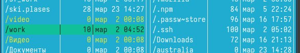{#fig:003 width=100%}

4) Выполните основные команды меню левой (или правой) панели. Оцените степень
подробности вывода информации о файлах. (рис. [-@fig:004])

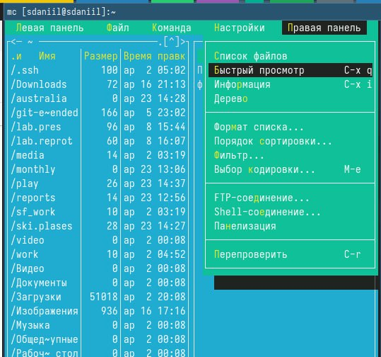{#fig:004 width=100%}

5)  Используя возможности подменю Файл , выполните:  
– просмотр содержимого текстового файла; (рис. [-@fig:005])  
– редактирование содержимого текстового файла (без сохранения результатов редактирования); (рис. [-@fig:006])  
– создание каталога; (рис. [-@fig:007])  
– копирование в файлов в созданный каталог (рис. [-@fig:008]).

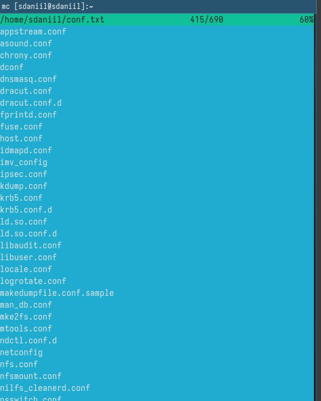{#fig:005 width=100%}

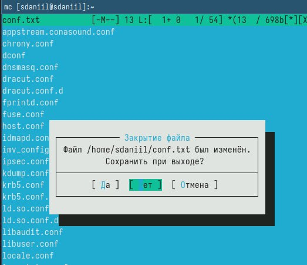{#fig:006 width=100%}

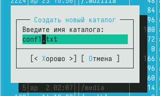{#fig:007 width=100%}

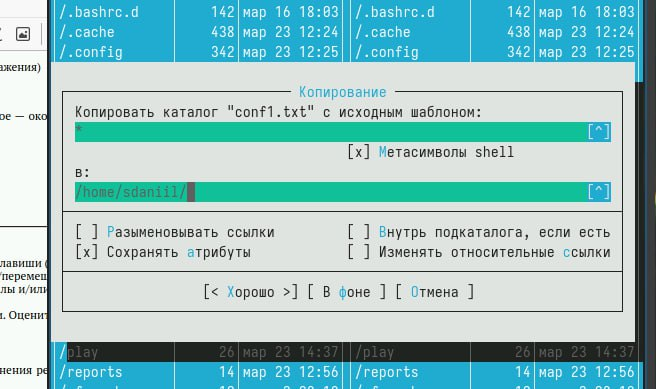{#fig:008 width=100%}

6) С помощью соответствующих средств подменю Команда осуществите:  
– поиск в файловой системе файла с заданными условиями (например, файла с расширением .c или .cpp, содержащего строку main); (рис. [-@fig:009])  
– выбор и повторение одной из предыдущих команд; (рис. [-@fig:0010])  
– переход в домашний каталог; (рис. [-@fig:0011])  
– анализ файла меню и файла расширений. (рис. [-@fig:0012]).
   
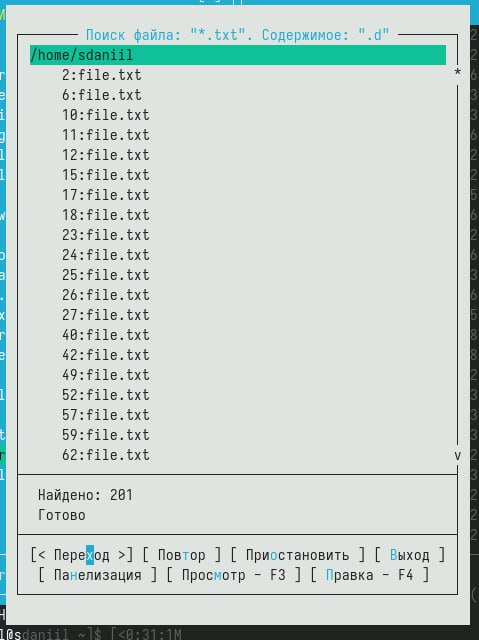{#fig:009 width=100%}

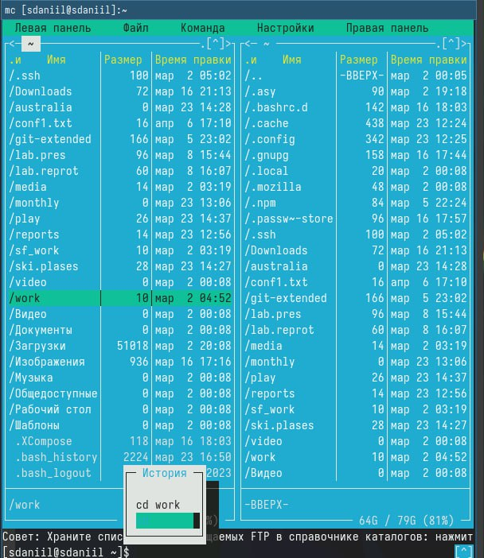{#fig:0010 width=100%}

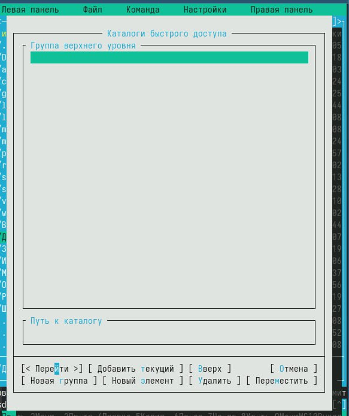{#fig:0011 width=100%}

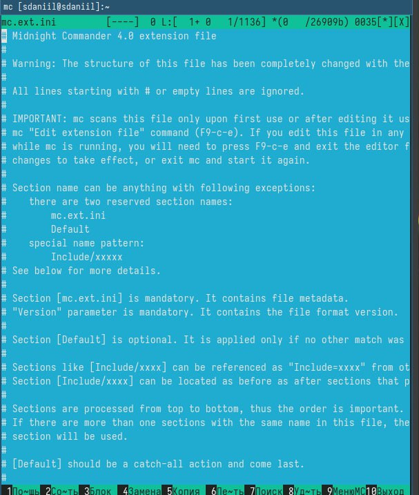{#fig:0012 width=100%}

7) Вызовите подменю Настройки . Освойте операции, определяющие структуру экрана mc
(Full screen, Double Width, Show Hidden Files и т.д.)ю (рис. [-@fig:0013]).

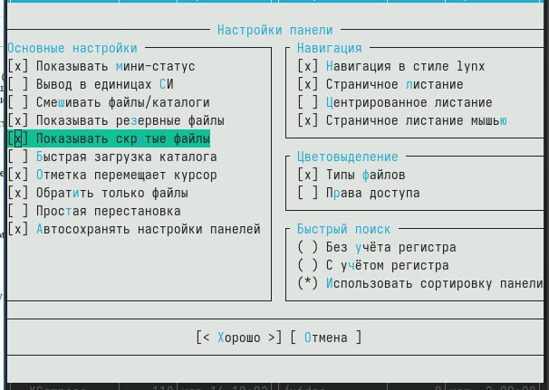{#fig:0013 width=100%}

8) 1. Создайте текстовой файл text.txt.  
2. Откройте этот файл с помощью встроенного в mc редактора.  
3. Вставьте в открытый файл небольшой фрагмент текста, скопированный из любого
другого файла или Интернета.  
4. Проделайте с текстом следующие манипуляции, используя горячие клавиши:  
4.1. Удалите строку текста.  
4.2. Выделите фрагмент текста и скопируйте его на новую строку.  
4.3. Выделите фрагмент текста и перенесите его на новую строку.  
4.4. Сохраните файл.  
4.5. Отмените последнее действие.  
4.6. Перейдите в конец файла (нажав комбинацию клавиш) и напишите некоторый
текст.  
4.7. Перейдите в начало файла (нажав комбинацию клавиш) и напишите некоторый
текст.  
4.8. Сохраните и закройте файл. (рис. [-@fig:0014]).

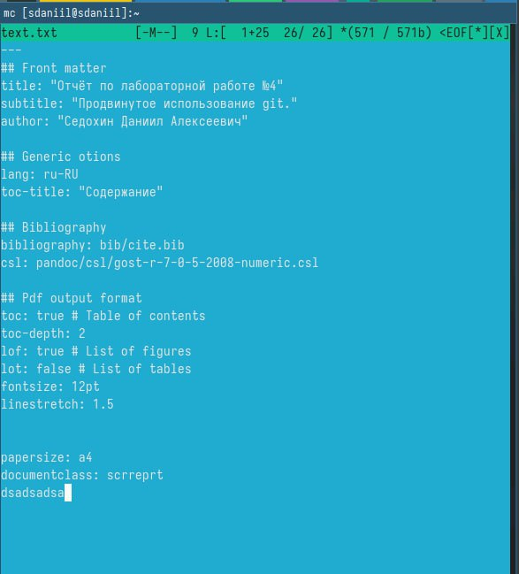{#fig:0014 width=100%}

9) Откройте файл с исходным текстом на некотором языке программирования (например C или Java)  
 Используя меню редактора, включите подсветку синтаксиса, если она не включена,
или выключите, если она включена. (рис. [-@fig:0015]).

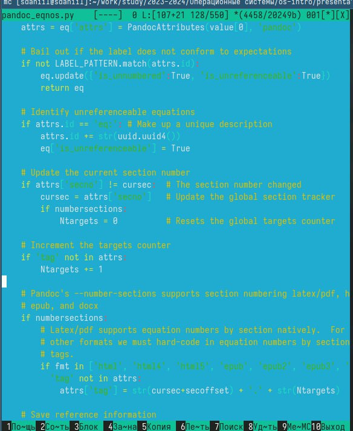{#fig:0015 width=100%}

# Контрольные вопросы

1. Режимы работы в mc: командный режим и панельный режим. Командный режим предоставляет доступ к полному функционалу командной строки, панельный режим - удобное отображение файлов и директорий.  
2. Операции с файлами: копирование, перемещение, удаление, изменение прав доступа. Например, в shell - cp, mv, rm, chmod, а в mc - F5, F6, F8, F9.  
3. Структура меню левой (или правой) панели: отображение файлов и директорий, команды для работы с ними (копирование, перемещение, удаление).  
4. Структура меню "Файл": команды для работы с файлами (новый файл, открыть, редактировать, удалить).  
5. Структура меню "Команда": выполнение различных команд, как на командной строке.  
6. Структура меню "Настройки": настройки отображения и поведения mc.  
7. Встроенные команды mc: переход по каталогам, редактирование файлов, создание директорий.  
8. Команды встроенного редактора mc: открытие, редактирование, сохранение файлов.  
9. Средства mc для создания пользовательских меню: возможность добавления собственных команд и скриптов.  
10. Средства mc для выполнения действий над файлами: изменение атрибутов, поиск, просмотр свойств.

# Выводы

Я освоил основные возможности командной оболочки Midnight Commander. Приобретел навыки практической работы по просмотру каталогов и файлов; манипуляций
с ними.
    
