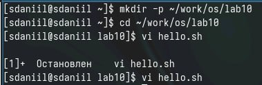
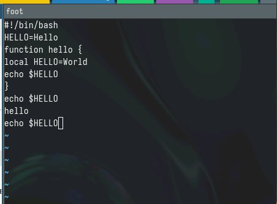
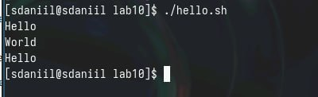

---
## Front matter
lang: ru-RU
title: Лабораторная работа №10
subtitle: Текстовой редактор vi
author:
  - Седохин Д.А.  
institute:
  - Российский университет дружбы народов, Москва, Россия  
  - 13 апреля 2024
 

## i18n babel
babel-lang: russian
babel-otherlangs: english

## Formatting pdf
toc: false
toc-title: Содержание
slide_level: 2
aspectratio: 169
section-titles: true
theme: metropolis
header-includes:
 - \metroset{progressbar=frametitle,sectionpage=progressbar,numbering=fraction}
 - '\makeatletter'
 - '\beamer@ignorenonframefalse'
 - '\makeatother'
 
##Fonts 
mainfont: PT Serif 
romanfont: PT Serif 
sansfont: PT Sans 
monofont: PT Mono 
mainfontoptions: Ligatures=TeX 
romanfontoptions: Ligatures=TeX 
sansfontoptions: Ligatures=TeX,Scale=MatchLowercase 
monofontoptions: Scale=MatchLowercase,Scale=0.9
---

# Информация

## Докладчик

:::::::::::::: {.columns align=center}
::: {.column width="70%"}

  * Седохин Даниил Алексееивч
  * Группа НПИбд-02-23
  * Российский университет дружбы народов
  * <https://github.com/Daniil2234>

:::
::: {.column width="30%"}

:::
::::::::::::::

# Вводная часть

## Цель работы

Познакомиться с операционной системой Linux. Получить практические навыки рабо-
ты с редактором vi, установленным по умолчанию практически во всех дистрибутивах.

## Выполнение необходимых заданий
- Выполнение небходимых заданий

{width=50%}

## Редактирование файла
- Редактирование файла

{width=50%}

## Проверка работы файла
- Проверка работы файла

{width=60%}

## Вывод
- Я познакомился с операционной системой Linux. 
- Получил практические навыки работы с редактором vi, установленным по умолчанию практически во всех дистрибутивах.
