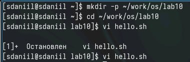
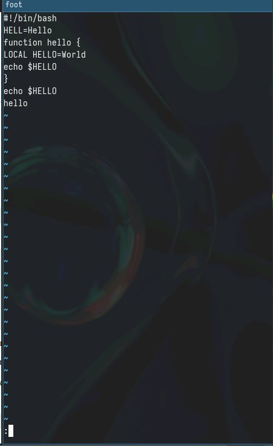
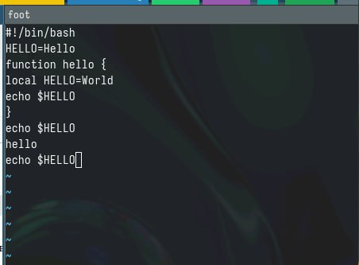
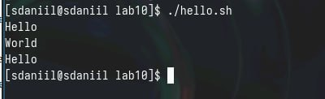

---
## Front matter
title: "Отчёт по лабораторной работе №10"
subtitle: "Текстовой редактор vi"
author: "Седохин Даниил Алексеевич"

## Generic otions
lang: ru-RU
toc-title: "Содержание"

## Bibliography
bibliography: bib/cite.bib
csl: pandoc/csl/gost-r-7-0-5-2008-numeric.csl

## Pdf output format
toc: true # Table of contents
toc-depth: 2
lof: true # List of figures
lot: false # List of tables
fontsize: 12pt
linestretch: 1.5
papersize: a4
documentclass: scrreprt
## I18n polyglossia
polyglossia-lang:
  name: russian
  options:
	- spelling=modern
	- babelshorthands=true
polyglossia-otherlangs:
  name: english
## I18n babel
babel-lang: russian
babel-otherlangs: english
## Fonts
mainfont: PT Serif
romanfont: PT Serif
sansfont: PT Sans
monofont: PT Mono
mainfontoptions: Ligatures=TeX
romanfontoptions: Ligatures=TeX
sansfontoptions: Ligatures=TeX,Scale=MatchLowercase
monofontoptions: Scale=MatchLowercase,Scale=0.9
## Biblatex
biblatex: true
biblio-style: "gost-numeric"
biblatexoptions:
  - parentracker=true
  - backend=biber
  - hyperref=auto
  - language=auto
  - autolang=other*
  - citestyle=gost-numeric
## Pandoc-crossref LaTeX customization
figureTitle: "Рис."
tableTitle: "Таблица"
listingTitle: "Листинг"
lofTitle: "Список иллюстраций"
lotTitle: "Список таблиц"
lolTitle: "Листинги"
## Misc options
indent: true
header-includes:
  - \usepackage{indentfirst}
  - \usepackage{float} # keep figures where there are in the text
  - \floatplacement{figure}{H} # keep figures where there are in the text
  
---

# Цель работы

Познакомиться с операционной системой Linux. Получить практические навыки рабо-
ты с редактором vi, установленным по умолчанию практически во всех дистрибутивах.

# Выполнение лабораторной работы

1)  Создайте каталог с именем ~/work/os/lab010.  
Перейдите во вновь созданный каталог.  
Вызовите vi и создайте файл hello.sh (рис. [-@fig:001]).

{#fig:001 width=100%}

2)  Нажмите клавишу i и вводите следующий текст.  
1 #!/bin/bash  
2 HELL=Hello  
3 function hello {  
4 LOCAL HELLO=World  
5 echo $HELLO  
6 }  
7 echo $HELLO  
8 hello  
5. Нажмите клавишу Esc для перехода в командный режим после завершения ввода
текста.  
6. Нажмите : для перехода в режим последней строки и внизу вашего экрана появится
приглашение в виде двоеточия.  
7. Нажмите w (записать) и q (выйти), а затем нажмите клавишу Enter для сохранения
вашего текста и завершения работы.  
8. Сделайте файл исполняемым
1 chmod +x hello.sh (рис. [-@fig:002]).

{#fig:002 width=100%}

3) Вызовите vi на редактирование файла
1 vi ~/work/os/lab06/hello.sh  
2. Установите курсор в конец слова HELL второй строки.  
3. Перейдите в режим вставки и замените на HELLO. Нажмите Esc для возврата в команд-
ный режим.  
4. Установите курсор на четвертую строку и сотрите слово LOCAL.  
5. Перейдите в режим вставки и наберите следующий текст: local, нажмите Esc для
возврата в командный режим.  
6. Установите курсор на последней строке файла. Вставьте после неё строку, содержащую
следующий текст: echo $HELLO.  
7. Нажмите Esc для перехода в командный режим.  
8. Удалите последнюю строку.  
9. Введите команду отмены изменений u для отмены последней команды.  
10. Введите символ : для перехода в режим последней строки. Запишите произведённые
изменения и выйдите из vi. (рис. [-@fig:003] (рис. [-@fig:004]).

{#fig:003 width=100%}

{#fig:004 width=100%}

# Контрольные вопросы

1. Режимы работы редактора vi: командный режим (Command mode), ввода текста (Insert mode), редактирования (Edit mode).  

2. Чтобы выйти из редактора vi, не сохраняя изменения, нужно находясь в командном режиме, нажать :q! и нажать Enter.  

3. Команды позиционирования включают h (влево), j (вниз), k (вверх), l (вправо).  

4. Для редактора vi словом считается последовательность символов, ограниченных пробелами или символами пунктуации.  

5. Чтобы перейти в начало файла, можно нажать gg, а для перехода в конец файла - G.  

6. Основные группы команд редактирования включают команды удаления (delete), копирования (yank), вставки (paste) и замены (replace).  

7. Для заполнения строки символами $ нужно находясь в командном режиме нажать 80i$ (где 80 - количество символов) и нажать Esc.  

8. Для отмены некорректного действия в редакторе vi можно использовать команду u в командном режиме.  

9. Основные группы команд режима последней строки включают команды сохранения (write/append), закрытия файла (quit) и выхода из редактора (exit).  

10. Для определения позиции окончания строки без перемещения курсора можно в командном режиме нажать $.   

11. Для анализа опций редактора vi нужно ввести :set в командном режиме. Опций много, их назначение можно узнать из документации или онлайн-ресурсов.  

12. Режим работы редактора vi определяется текущим режимом, отображаемым в нижней части экрана: --INSERT-- (ввод текста), --COMMAND-- (командный режим).  

13. Граф взаимосвязи режимов работы редактора vi может быть описан следующим образом: командный режим (Command mode) -> ввод текста (Insert mode) -> редактирование (Edit mode) -> сохранение и выход (Last line mode).  

# Выводы

Я Познакомиться с операционной системой Linux. Получить практические навыки рабо-
ты с редактором vi, установленным по умолчанию практически во всех дистрибутивах.
    
    
