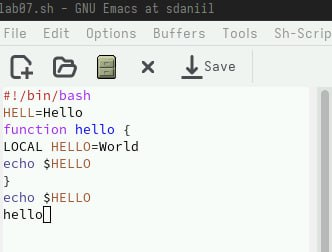
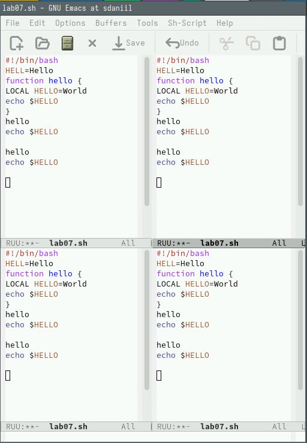
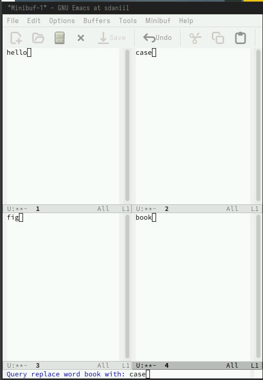

---
## Front matter
title: "Отчёт по лабораторной работе №11"
subtitle: "Текстовой редактор emacs"
author: "Седохин Даниил Алексеевич"

## Generic otions
lang: ru-RU
toc-title: "Содержание"

## Bibliography
bibliography: bib/cite.bib
csl: pandoc/csl/gost-r-7-0-5-2008-numeric.csl

## Pdf output format
toc: true # Table of contents
toc-depth: 2
lof: true # List of figures
lot: false # List of tables
fontsize: 12pt
linestretch: 1.5
papersize: a4
documentclass: scrreprt
## I18n polyglossia
polyglossia-lang:
  name: russian
  options:
	- spelling=modern
	- babelshorthands=true
polyglossia-otherlangs:
  name: english
## I18n babel
babel-lang: russian
babel-otherlangs: english
## Fonts
mainfont: PT Serif
romanfont: PT Serif
sansfont: PT Sans
monofont: PT Mono
mainfontoptions: Ligatures=TeX
romanfontoptions: Ligatures=TeX
sansfontoptions: Ligatures=TeX,Scale=MatchLowercase
monofontoptions: Scale=MatchLowercase,Scale=0.9
## Biblatex
biblatex: true
biblio-style: "gost-numeric"
biblatexoptions:
  - parentracker=true
  - backend=biber
  - hyperref=auto
  - language=auto
  - autolang=other*
  - citestyle=gost-numeric
## Pandoc-crossref LaTeX customization
figureTitle: "Рис."
tableTitle: "Таблица"
listingTitle: "Листинг"
lofTitle: "Список иллюстраций"
lotTitle: "Список таблиц"
lolTitle: "Листинги"
## Misc options
indent: true
header-includes:
  - \usepackage{indentfirst}
  - \usepackage{float} # keep figures where there are in the text
  - \floatplacement{figure}{H} # keep figures where there are in the text
  
---

# Цель работы

Познакомиться с операционной системой Linux. Получить практические навыки работы с редактором Emacs.

# Выполнение лабораторной работы

 1. Открыть emacs.  
2. Создать файл lab07.sh с помощью комбинации Ctrl-x Ctrl-f (C-x C-f).  
3. Наберите текст:  
1 #!/bin/bash  
2 HELL=Hello  
3 function hello {  
4 LOCAL HELLO=World  
5 echo $HELLO  
6 }   
7 echo $HELLO  
8 hello (рис. [-@fig:001]).

{#fig:001 width=100%}

 4. Сохранить файл с помощью комбинации Ctrl-x Ctrl-s (C-x C-s).  
5. Проделать с текстом стандартные процедуры редактирования, каждое действие должно осуществляться комбинацией клавиш.  
5.1. Вырезать одной командой целую строку (С-k).  
5.2. Вставить эту строку в конец файла (C-y).  
5.3. Выделить область текста (C-space).  
5.4. Скопировать область в буфер обмена (M-w).  
5.5. Вставить область в конец файла.  
5.6. Вновь выделить эту область и на этот раз вырезать её (C-w).  
5.7. Отмените последнее действие (C-/).  
6. Научитесь использовать команды по перемещению курсора.  
6.1. Переместите курсор в начало строки (C-a).  
6.2. Переместите курсор в конец строки (C-e).  
6.3. Переместите курсор в начало буфера (M-<).  
6.4. Переместите курсор в конец буфера (M->).  
7. Управление буферами.  
7.1. Вывести список активных буферов на экран (C-x C-b).  
7.2. Переместитесь во вновь открытое окно (C-x) o со списком открытых буферов
и переключитесь на другой буфер.  
7.3. Закройте это окно (C-x 0).  
7.4. Теперь вновь переключайтесь между буферами, но уже без вывода их списка на
экран (C-x b)  (рис. [-@fig:002]).

{#fig:002 width=100%}

8. Управление окнами.  
8.1. Поделите фрейм на 4 части: разделите фрейм на два окна по вертикали (C-x 3),
а затем каждое из этих окон на две части по горизонтали (C-x 2) (рис. [-@fig:003]).

{#fig:003 width=100%}

 8.2. В каждом из четырёх созданных окон откройте новый буфер (файл) и введите
несколько строк текста.  
9. Режим поиска  
9.1. Переключитесь в режим поиска (C-s) и найдите несколько слов, присутствующих
в тексте.  
9.2. Переключайтесь между результатами поиска, нажимая C-s.  
9.3. Выйдите из режима поиска, нажав C-g. (рис. [-@fig:004])

{#fig:004 width=100%}

9.4. Перейдите в режим поиска и замены (M-%), введите текст, который следует найти
и заменить, нажмите Enter , затем введите текст для замены. После того как будут
подсвечены результаты поиска, нажмите ! для подтверждения замены. (рис. [-@fig:005])

{#fig:005 width=100%}

9.5. Испробуйте другой режим поиска, нажав M-s o. (рис. [-@fig:006])

{#fig:006 width=100%}

# Контрольные вопросы

1. Emacs — мощный текстовый редактор с широким спектром функций и возможностей.  

2. Сложность Emacs для новичка может создавать гибкая настройка, множество команд и сочетаний клавиш, а также нетрадиционный интерфейс.  
  
3. Буфер в Emacs — это область памяти для хранения текста, который можно редактировать, а окно — прямоугольная область для отображения содержимого буфера.  

4. В Emacs можно открыть более 10 буферов в одном окне.  

5. При запуске Emacs создаются по умолчанию буферы, такие как *scratch* для временного хранения текста и *Messages* для отображения сообщений.  

6. Для ввода сочетания C-c | нажмите Ctrl и c, затем вертикальную черту. Для C-c C-| сочетание будет Ctrl и c, затем Ctrl и |.  

7. Чтобы разделить текущее окно на две части в Emacs, используйте команду "C-x 2".  

8. Настройки редактора Emacs хранятся в файле ".emacs" или "init.el".  

9. Клавиша выполняет определенную функцию в Emacs, и ее можно переназначить по желанию пользователя.  

10. Комфортнее работать в редакторе vi или Emacs — это вопрос предпочтений. Некоторые предпочитают vi за легкость в освоении, а другие выбирают Emacs за мощные функции и гибкую настройку.  

# Выводы

Я Познакомиться с операционной системой Linux. Получить практические навыки работы с редактором Emacs.
    
    
